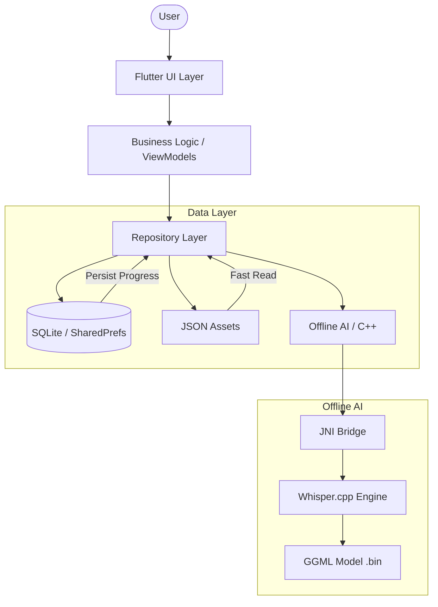

<p align="center">
  
</p>

<h1 align="center" style="font-family: Arial, sans-serif; color: #FF6F61; text-shadow: 2px 2px 4px rgba(0,0,0,0.5);">
  SPEECHMATE
</h1>

<p align="center">
  <em>"Where Language Barrier Ends."</em>
</p>

<p align="center">
  <a>
    
  </a>
  <a>
    
  </a>
  <a>
    
  </a>
  <a>
    
  </a>
</p>

---

## 🌏 The Mission: More Than Just Code

**Every 14 days, a language dies.** When a language disappears, we don't just lose words; we lose centuries of wisdom, culture, and identity.

## 🏗️ Architecture

<p align="center">
  
</p>

# Architecture - Clean & Offline First


While we started with **Nicobarese**—the heartbeat of the Nicobar Islands—our vision is far greater. We are building a digital ark for **all endangered tribal languages**. 

This isn't just an app. It's a bridge between generations. It helps teachers pass the language of our ancestors to students—so it is never lost.
---

## 🚀 Key Features

We combined detailed cultural preservation with cutting-edge tech:

*   **⚡ Offline-First Architecture:** Works completely without internet. Because culture shouldn't depend on connectivity.
*   **🗣️ Smart Pronunciation (TTS):** Customized Text-to-Speech engine acts as a digital guide for teachers.
*   **🌍 Community Hub:** A simulated social space for learners to share "Words of the Day" and challenges.
*   **🛡️ Admin & Teacher Modes:** specialized dashboards with role-based access control.
*   **🧠 Gamified Learning:** visual flashcards, streaks, and "Level Up" mechanics for students.
*   **🎨 Rive Animations:** Smooth, 60fps vector animations that make learning feel alive.
*   **🔌 Zero Latency Search:** Instant result lookup using optimized local JSON assets.

---

## 📸 Experience The App

### StartUp & Onboarding
<p align="center">
  
  
  
  
</p>

### Role-Based Dashboards (Student vs Teacher)
<p align="center">
  
  
  
  
</p>

### Interactive Learning Modules
<p align="center">
  
  
  
  
</p>

---

## 🛠️ Installation & Setup

Want to run this locally? Follow these steps:

### Prerequisites
*   [Flutter SDK](https://flutter.dev/docs/get-started/install) (3.0.0 or higher)
*   VS Code or Android Studio

### Steps
1.  **Clone the Repository**
    ```bash
    git clone https://github.com/sathiyatskrj/Speechmate.git
    cd Speechmate
    ```

2.  **Install Dependencies**
    ```bash
    flutter pub get
    ```

3.  **Run the App**
    ```bash
    flutter run
    ```

---

## 🔮 The Future: "Project Tribal-Link"

SpeechMate is the prototype engine. Our roadmap includes:

1.  **Multi-Dialect Support:** Expanding to **Onges, Great Andamanese etc**.
2.  **Voice Contribution:** Allowing elders to record pronunciations directly into the app to build a "Voice Archive".
3.  **AI Integration:** Using machine learning to translate full sentences from local dialects to English.

---
<p align="center">
  *Preserving the past, coding the future.*
</p>


