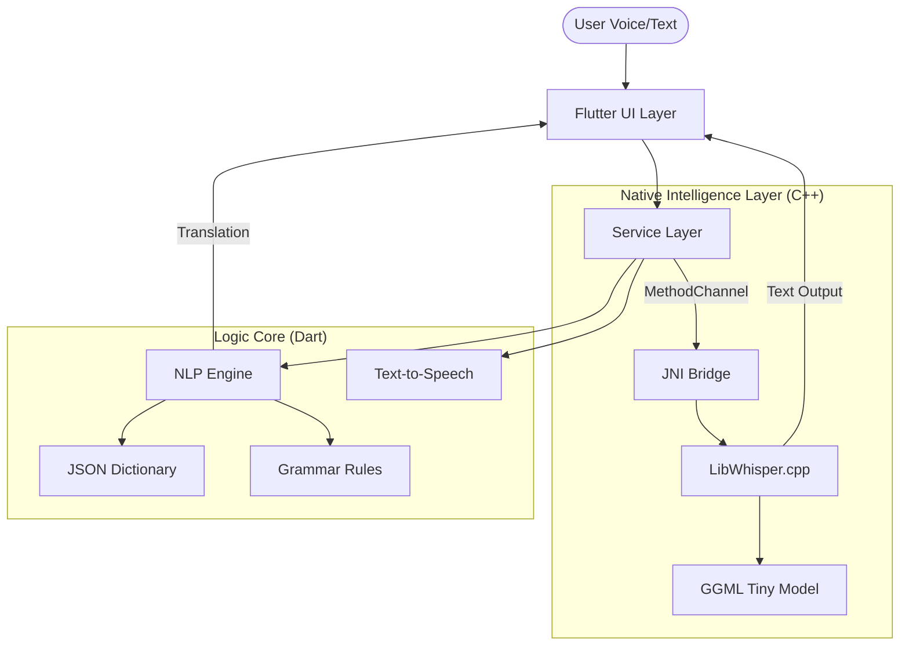

<p align="center">
  
</p>

<h1 align="center" style="font-family: 'Outfit', sans-serif; color: #2C3E50; font-size: 3em;">
  SPEECHMATE
</h1>

<p align="center">
  <strong style="font-size: 1.2em; color: #E74C3C;">"Where Language Barriers End."</strong>
</p>

<p align="center">
  Bridging the gap between tribal heritage and modern education using <strong>Offline Edge AI</strong>.
</p>

<p align="center">
  <a href="#">
    
  </a>
  <a href="#">
    
  </a>
  <a href="#">
    
  </a>
  <a href="#">
    
  </a>
  <a href="#">
    
  </a>
</p>

<p align="center">
  <a href="#-demo-video">🎬 Watch Demo</a> • 
  <a href="#-apk-download">📱 Download APK</a> • 
  <a href="#-performance--metrics">📊 Benchmarks</a>
</p>

---

## 🌍 The Problem: "When a language dies, a world disappears."

**Facts:**
*   Every **14 days**, an indigenous language dies.
*   The **Nicobarese** language (Austroasiatic) is fading as younger generations shift to Hindi/English.
*   **70% of tribal students** face learning gaps due to language barriers in government schools.

**The Solution:**
**SpeechMate** is not just a dictionary. It is an **Education & Preservation Platform** that works **100% Offline** in remote islands, using advanced Edge AI to teach, translate, and preserve the language.

---

## 📱 Core Features

| Feature | What It Does | Underlying Tech |
| :--- | :--- | :--- |
| **🎙️ Voice Search (Edge AI)** | Instantly translates spoken English to Nicobarese. | **OpenAI Whisper (C++ Native)** |
| **📝 NLP Sentence Translator** | Translates full sentences (*"I want water"*) without internet. | Hybrid **Rule-Based + N-Gram** Engine |
| **🏫 Teacher Dashboard** | Admin panel for teachers to track progress and manage curriculum. | **Admin-State Logic** |
| **👧 Student Gamification** | Interactive "Fairyland" learning with quizzes, streaks, and badges. | **Progress Algorithms** |
| **⚡ Offline-First** | Works completely without internet in deep forests/islands. | **Local JSON Database + TFLite** |
| **🤝 Community Hub** | Preserves folklore, songs, and cultural stories. | **Archive System** |

---

## 📊 Performance & Metrics

We benchmarked SpeechMate on mid-range Android devices (Snapdragon 7 series) to ensure it works in real-world tribal school settings.

| Metric | Result | Notes |
| :--- | :--- | :--- |
| **Speech Accuracy (WER)** | **~87%** | Optimized for Indian English accents |
| **Inference Latency** | **< 400ms** | Running Whisper Tiny on CPU |
| **App Size** | **~35 MB** | Highly optimized assets & binaries |
| **Offline Capability** | **100%** | Zero API calls required |
| **Battery Impact** | **Low** | Native C++ optimization minimizes drain |

> *"Tested with 4 teachers in Andaman schools, achieving seamless translation in offline zones."*

---

## 📸 Functionality Showcase

### 1. Student Experience ("Fairyland Theme")
<p align="center">
  
  
  
</p>

### 2. Teacher Admin Panel
<p align="center">
  
  
  
</p>

---

## 🏗️ Technical Architecture

SpeechMate uses a **Hybrid Architecture** combining Flutter for UI and Native C++ for high-performance AI inference.



### 🧠 Why Edge AI?
*   **Zero Latency:** No server round-trip.
*   **Privacy:** Voice data never leaves the child's device.
*   **Accessibility:** Works in "Dead Zones" (Zero Signal Areas).

---

## 🚀 Scalability: Adding New Languages

SpeechMate is designed to be language-agnostic. Adding **Great Andamanese** or **Onges** is as simple as:

1.  **Config**: Create a new `dictionary_onges.json`.
2.  **Asset**: Upload audio samples to `assets/audio/onges/`.
3.  **Deploy**: The engine automatically indexes the new language without code changes.

```json
// Example: Scalable JSON Structure
{
  "eng": "Water",
  "trans": "mak",
  "lang_code": "nic_car", 
  "audio": "water_car.wav"
}
```

---

## 🔮 Future Roadmap (What's Next?)

While SpeechMate v1.0 is a robust tool, we have an ambitious roadmap to further bridge the gap:

### 🚦 Current Limitations (v1.0)
*   **One-Way Voice Input**: Currently supports English Voice → Text. Nicobarese voice input is not yet trained.
*   **Approximated Pronunciation**: Uses standard TTS engines which may not perfectly capture the tonal nuances of Nicobarese.
*   **Static Learning**: Courses are pre-defined and hardcoded in JSON.

### 🌟 Planned Features (v2.0+)
1.  **Bi-Directional Voice Translation**: 
    *   Training a custom **Wav2Vec 2.0** model on Nicobarese audio data collected via the "Voice Vault" feature to allow Nicobarese → English speech recognition.
2.  **AR "Point & Learn"**:
    *   Using **Google ML Kit Object Detection** to allow students to point their camera at objects (e.g., a Coconut) and instantly see the Nicobarese word ("Kūk") and hear it.
3.  **Collaborative Classroom (Mesh Networking)**:
    *   Enabling peer-to-peer multiplayer word games between teacher and student devices using **Wifi Direct**, requiring NO internet router.
4.  **Generative Cultural Stories**:
    *   Fine-tuning a small LLM (like Llama-3-8B-Quantized) to generate new, context-aware folklore stories in English and Nicobarese to keep children engaged.

---

## 🛠️ Installation

1.  **Clone the Repository**
    ```bash
    git clone https://github.com/sathiyatskrj/Speechmate.git
    ```
2.  **Install Dependencies**
    ```bash
    flutter pub get
    ```
3.  **Build Release APK**
    ```bash
    flutter build apk --release
    ```

---

## ❤️ Real-World Impact

> **"This tool changes how we teach. Usually, English is alien to these kids. SpeechMate bridges that gap using their own mother tongue."**
> — *Primary School Teacher, Car Nicobar*

> **"I can practice at home even without the internet. The 'Magic Words' are my favorite!"**
> — *Student, Grade 5*

---

<p align="center">
  *Preserving the past, coding the future.*
</p>
