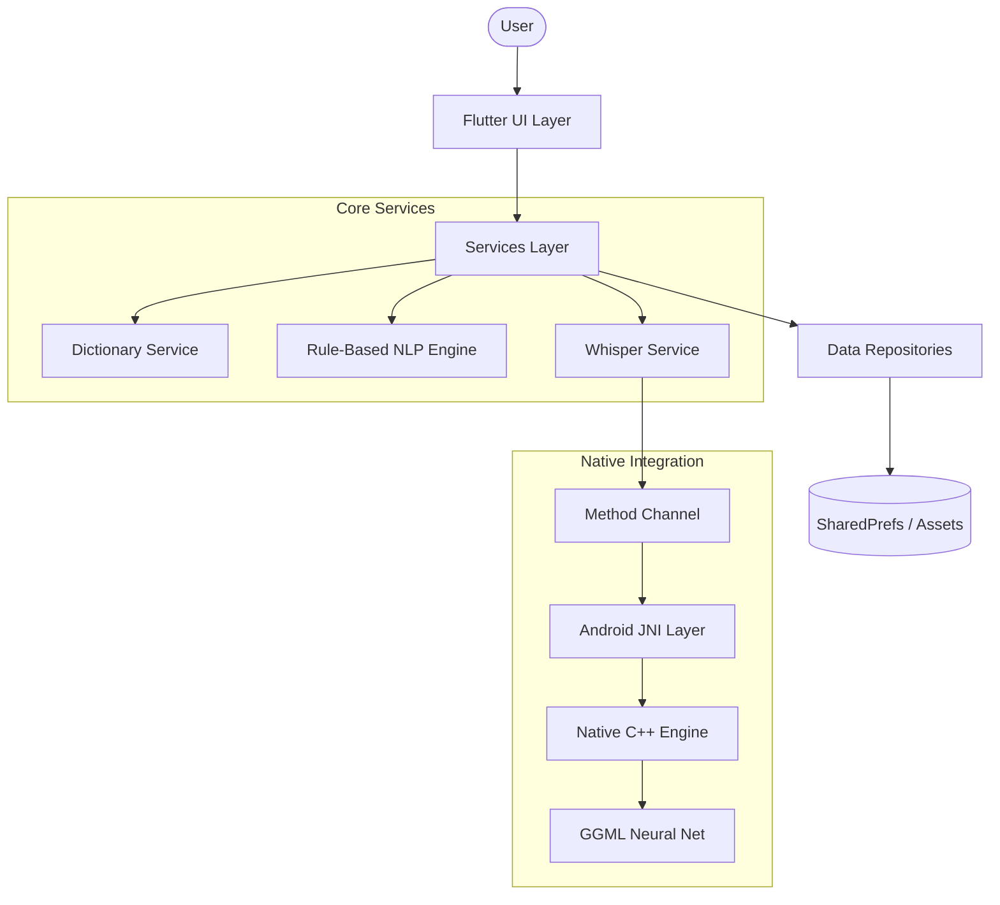

<p align="center">
  
</p>

<h1 align="center" style="font-family: Arial, sans-serif; color: #FF6F61; text-shadow: 2px 2px 4px rgba(0,0,0,0.5);">
  SPEECHMATE
</h1>

<p align="center">
  <em>"Where Language Barrier Ends."</em>
</p>

<p align="center">
  <a>
    
  </a>
  <a>
    
  </a>
  <a>
    
  </a>
  <a>
    
  </a>
  <a>
    
  </a>
</p>

---

## 🌏 The Mission: Hack for Social Cause

**Every 14 days, a language dies.** When a language disappears, we don't just lose words; we lose centuries of wisdom, culture, and identity.

**SpeechMate** is a digital ark built for the **Nicobarese** tribal community. It bridges the gap between elders and the new generation using advanced **Offline AI**, ensuring their heritage survives even without internet access.

---

## 🚀 Key Features (Hackathon Edition)

We combined deep cultural preservation with cutting-edge Edge AI:

### 🧠 1. Offline NLP Sentence Translation (**NEW**)
*   **Real-Time Engine:** Translates full sentences like *"I want water"* -> *"Yuo Tangle Dak"* instantly.
*   **Hybrid Logic:** Uses a smart rule-based engine that combines Dictionary Lookups with N-Gram Phase Matching.
*   **Zero Internet:** Runs 100% locally on the device.

### 🤖 2. "Smart Mode" AI Assistant (**NEW**)
*   **Whisper Integration:** Uses OpenAI's **Whisper** model running natively via C++/JNI.
*   **Voice Control:** Students can tap the "Glowing Orb" to speak commands or search words.
*   **Privacy First:** No audio leaves the device. Everything is processed on the Edge.

### 💎 3. Premium UI/UX Overhaul
*   **Student Dashboard:** Features a modern **Bento Grid** layout with glassmorphism effects and gradient tiles.
*   **Teacher Dashboard:** Professional "Admin Panel" look with Analytics Cards (Students, Words Learned) and Quick Translate tools.
*   **Gamification:** Streaks, Daily Words, and "Magic" hidden treasures to keep students engaged.

---

## 🏗️ Technical Architecture

SpeechMate follows a **Clean, Offline-First Architecture**:



### 🛠️ Tech Stack
*   **Frontend:** Flutter (Dart)
*   **Native Layer:** C++ (for AI inference), Kotlin (for Android Glue)
*   **AI Model:** OpenAI Whisper (Quantized for Mobile via `whisper.cpp`)
*   **State Management:** Native `setState` + Service Locator Pattern (Singleton Services)
*   **Data:** JSON-based Asset Database + SharedPreferences for progress tracking.

---

## 📸 Experience The App

### 1. Smart AI & NLP
<p align="center">
  
  
</p>

### 2. Professional Dashboards
<p align="center">
  
  
</p>

---

## 🛠️ Installation & Setup

Want to run this locally? Follow these steps:

### Prerequisites
*   [Flutter SDK](https://flutter.dev/docs/get-started/install) (3.0.0 or higher)
*   Android Phone (Recommend Android 10+)
*   *Note: iOS support is planned but currently uses Android JNI.*

### Steps
1.  **Clone the Repository**
    ```bash
    git clone https://github.com/sathiyatskrj/Speechmate.git
    cd Speechmate
    ```

2.  **Install Dependencies**
    ```bash
    flutter pub get
    ```

3.  **Run the App**
    ```bash
    flutter run
    ```
    *(Note: Connect a physical Android device for the Whisper AI to work optimally)*

---

## 🔮 The Future: "Project Tribal-Link"

SpeechMate is the prototype engine. Our roadmap includes:

1.  **Multi-Dialect Support:** Expanding to **Onges, Great Andamanese etc**.
2.  **Voice Contribution:** Allowing elders to record pronunciations directly into the app to build a "Voice Archive".
3.  **Cross-Platform AI:** Porting the C++ bridge to iOS/Swift.

---
<p align="center">
  *Preserving the past, coding the future.*
</p>
