

  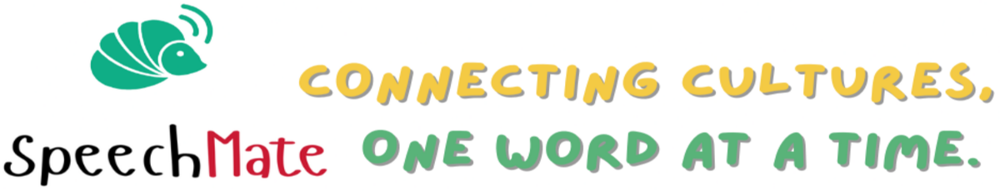

<h1 align="center" style="font-family: Arial, sans-serif; color: #FF6F61; text-shadow: 2px 2px 4px rgba(0,0,0,0.5);">
  SPEECHMATE
</h1>

  

  

  

  

  

SpeechMate is a Flutter-based mobile application designed to help users translate English words into Nicobarese in a simple, intuitive, and visually engaging way.
The app is built with both students and teachers in mind, providing role-based dashboards and features to support learning, teaching, and language preservation.

The goal of SpeechMate is to make bilingual word lookup fast, accessible, and easy to understand, even for users with minimal technical knowledge.

# Features🔧

- 🔍 English to Nicobarese Translation
- 🎓 Role-based Access
    - Student Dashboard
    - Teacher Dashboard
- 🧠 Common Words Cards for quick lookup
- 🖱️ Tap Animations for better user interaction
- 🎨 Modern UI with Gradient Design
- 🔊 Text-to-Speech (TTS) support (Teacher Dashboard)
- ⌨️ Auto-hide Keyboard after search
- ⚠️ Graceful Error Handling (e.g., “Word not found”)
- 🖼️ Images base learning for Students
- 友 Language Selector

# Screenshots
>StartUp Screens

  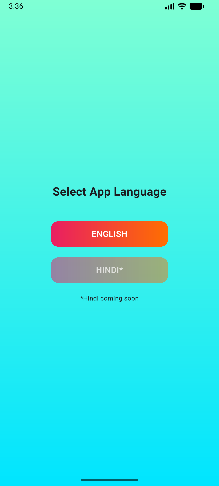
  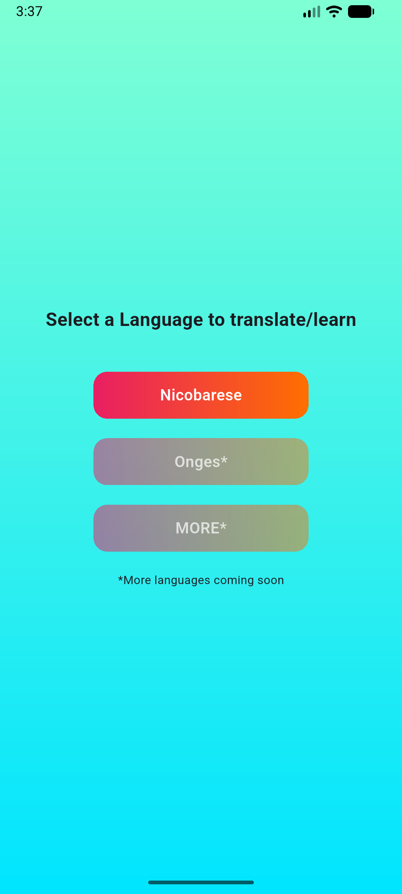
  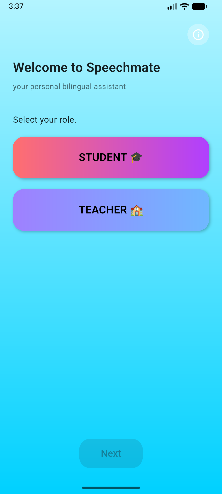
  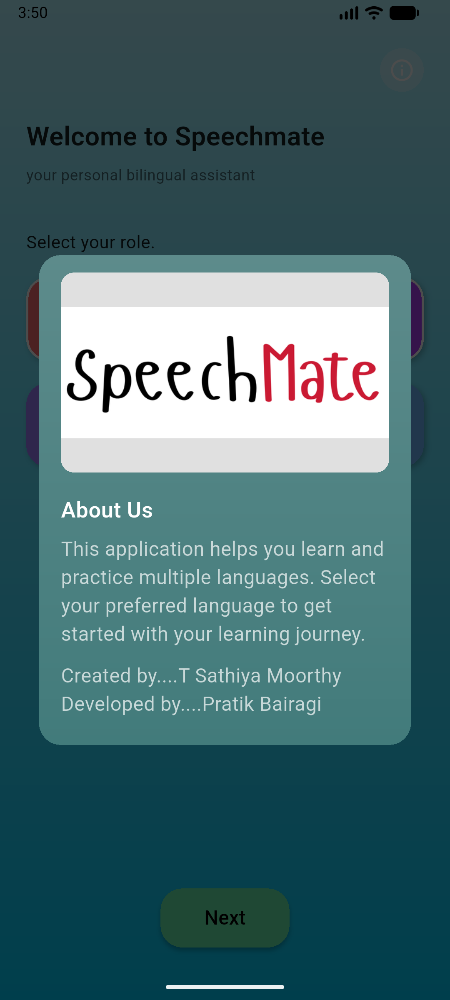

>Student, Teachers roles Dashboards with Bothway word search

  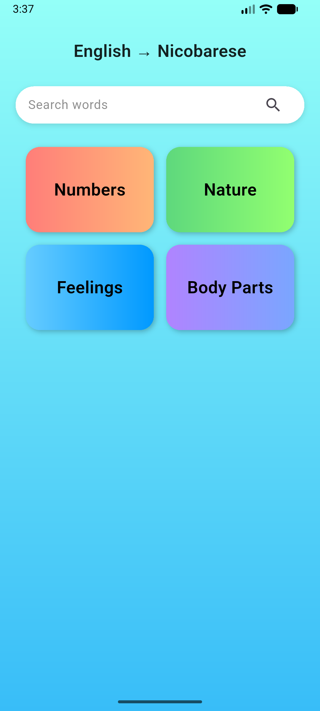
  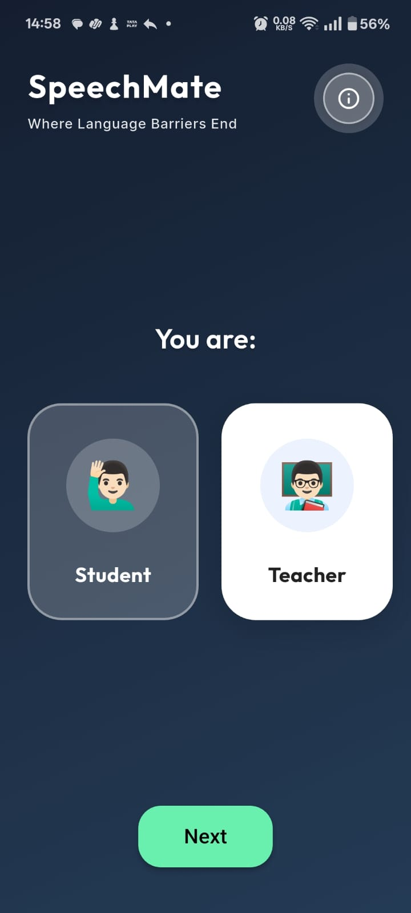
  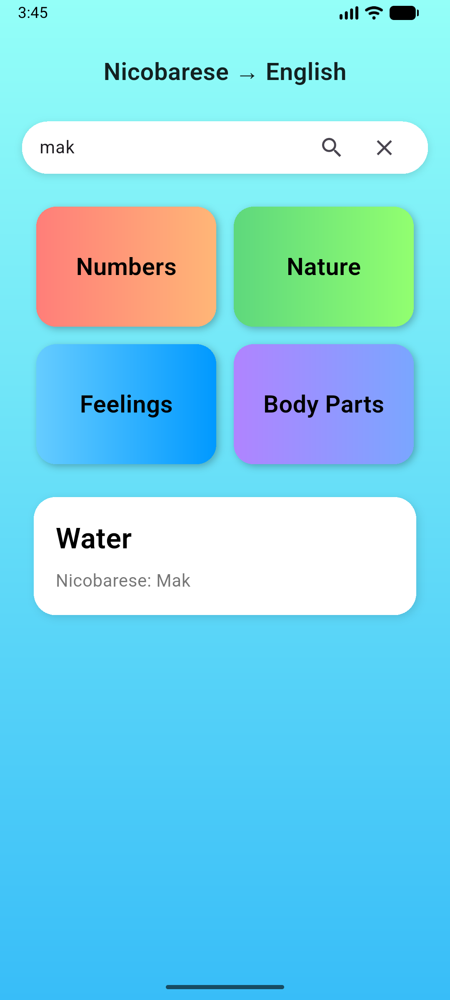
  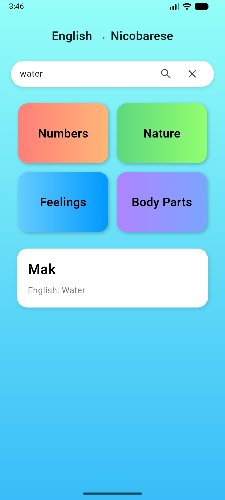

>Different pages for student learnings role

  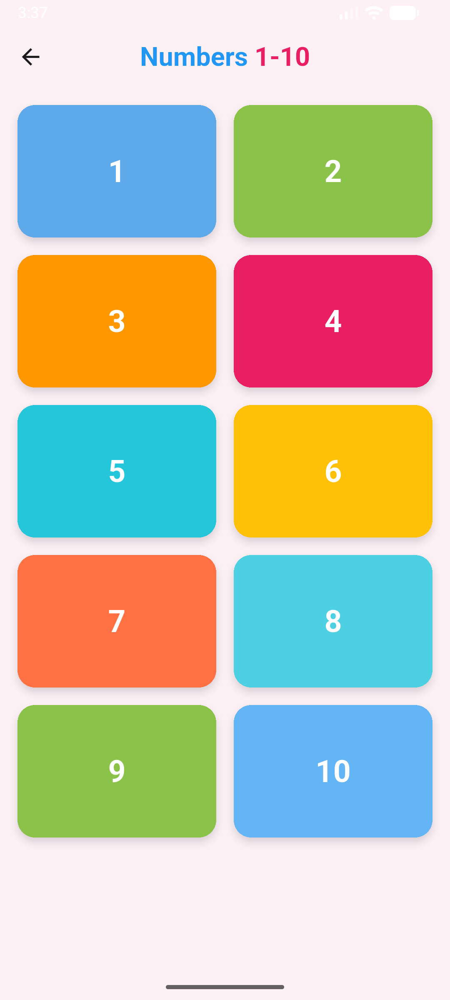
  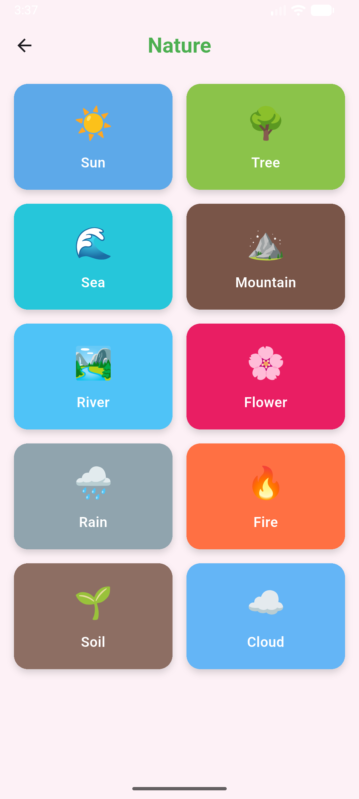
  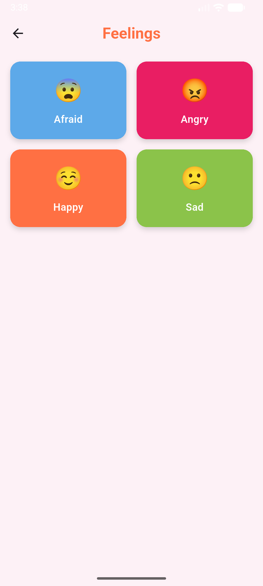
  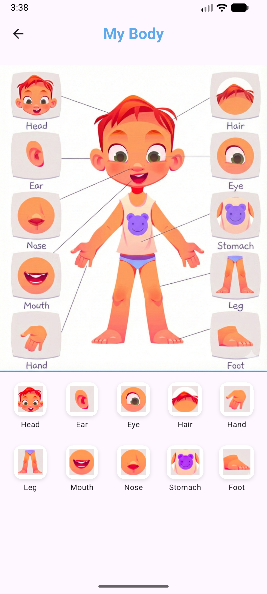

# ⚙️ How It Works / Technologies Used
> This section explains the internal working of the app.

### 🛠️ Technologies

- Flutter – UI and application logic
- Dart – Programming language
- JSON – Local dictionary storage
- Text-to-Speech (TTS) – Pronunciation support for teachers
- Material Design – Clean and consistent UI components

### 🔄 Workflow

**1.** User selects a role (Student / Teacher)  
**2.** Enters or taps a word to search  
**3.** App searches the local JSON dictionary  
**4.** Matching translation is displayed in a translation card  
**5.** Teacher can use TTS to hear pronunciation  
**6.** Common word cards allow instant lookup without typing  
**7.** The app is fully offline, making it usable in low-connectivity environments.

# 🎯 Problem It Solves

**1.** Helps bridge the language gap between English and Nicobarese  
**2.** Supports students in learning new words quickly  
**3.** Assists teachers in explaining pronunciation using TTS  
**4.** Preserves and promotes a regional language in digital form  
**5.** Eliminates dependency on the internet for translations  
**6.** Provides a simple learning tool for areas with limited resources

## 🚀 Future Enhancements

- Sentence translation
- Voice input for search
- More Nicobarese dialect support

## Contributers
- [Pratik](https://github.com/Lyco0) (Main Developer)