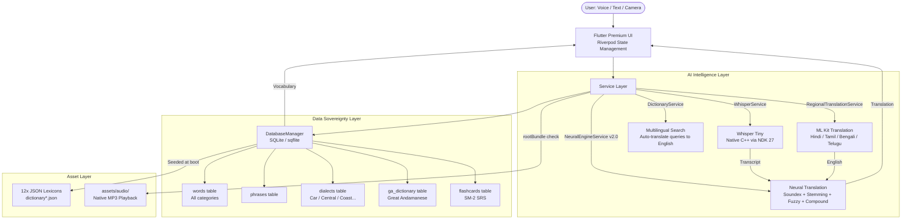

<p align="center">
  
</p>

<h1 align="center">SPEECHMATE</h1>

<p align="center">
  <strong>"Preserving Heritage, Coding the Future."</strong>
</p>

<p align="center">
  Bridging the gap between tribal heritage and modern education using <strong>Offline Gen-AI</strong> and an <strong>Indigenous Digital Sovereignty Hub</strong>.
</p>

<p align="center">
  <a href="#">
    
  </a>
  <a href="#">
    
  </a>
  <a href="#">
    
  </a>
  <a href="#">
    
  </a>
  <a href="#">
    
  </a>
  <a href="#">
    
  </a>
  <a href="#">
    
  </a>
</p>

<p align="center">
  <a href="#-the-problem">🌍 Problem</a> •
  <a href="#-core-features">✨ Features</a> •
  <a href="#-architecture">🏗️ Architecture</a> •
  <a href="#-language-modules">🗣️ Languages</a> •
  <a href="#-installation">🚀 Install</a>
</p>

---

## 🌍 The Problem: "When a language dies, a world disappears."

**Facts:**
*   Every **14 days**, an indigenous language dies globally.
*   Languages like **Car Nicobarese** (Austroasiatic) and **Great Andamanese** (language isolate) are critically endangered as younger generations shift to Hindi and English.
*   **70% of tribal students** face learning gaps due to language barriers in government schools.
*   The Andaman & Nicobar Islands have **zero dedicated digital tools** for tribal language education.

**The Solution:**
**SpeechMate** is an indigenous-first **Digital Sovereignty Hub** — not just a dictionary, but a **Universal Education & Preservation Platform**. It operates **100% offline** in remote islands and rainforests, combining a full learning suite with an on-device **Whisper AI speech engine** to teach, translate, and preserve endangered indigenous dialects.

---

## ✨ Core Features

### 🎓 Student Dashboard
| Module | Description |
| :--- | :--- |
| **📚 12 Learning Categories** | Numbers, Nature, Feelings, Colors, Things, Body Parts, Animals, Magic Words, Family, and more — all loaded from verified Nicobarese JSON lexicons |
| **🔍 AR Translator** | Live Augmented Reality translator using Google ML Kit Image Labeler to detect 400+ specific objects, featuring 3 Lens Modes (Auto/Objects/Text), direct Vault saving, and **dynamic FPS-aware throttling** that auto-adjusts processing speed (300–1000ms) based on device performance |
| **🎙️ Whisper Pro STT** | On-device speech-to-text using the `ggml-tiny.en.bin` model for offline voice search |
| **🔊 Audio-First Playback** | Native `.mp3` audio asset playback for each word; graceful TTS fallback when audio is unavailable |
| **🧩 Games Hub** | Word Match, Flash Cards, Word Scramble, and Word Runner — gamified vocabulary learning with XP **diminishing returns** to prevent farming |
| **💬 AI Chat Translator** | Conversational translation interface powered by **Neural Engine v2.0** |
| **🗂️ Voice Vault** | Record, store, and preserve oral history and folklore |
| **🌍 Community Hub** | Shared learning feed connecting students and educators |
| **🏝️ Island Explorer (GIS)** | Custom-painted Andaman & Nicobar archipelago map visualizing dialect distribution zones |
| **📖 Flashcard SRS** | SM-2 spaced repetition system for long-term word retention |
| **🌐 Dynamic Localization** | 100% localized interface supporting 8 languages seamlessly across the entire dashboard |
| **🇮🇳 Regional Translators** | Bidirectional translation between Nicobarese and **Hindi, Tamil, Bengali, Telugu** (offline via ML Kit) and **Malayalam** (online cloud fallback) |
| **🔎 Multilingual Search** | Type in any regional language script — the search engine auto-translates to English before looking up the Nicobarese equivalent |

### 👩‍🏫 Teacher Dashboard
| Module | Description |
| :--- | :--- |
| **🎤 Whisper Pro** | Live voice-to-search transcription to look up tribal vocabulary instantly |
| **📝 Common Phrases** | Pre-built classroom phrase bank with audio |
| **🏆 Certification Levels** | Structured proficiency levels (1–10) with unlock progression |
| **🧪 Quiz Mode** | Adaptive vocabulary quiz with missed-word re-injection |
| **📊 Progress & SRS Analytics** | Class-level progress tracking and spaced repetition dashboards |
| **📷 Book Scanner (OCR)** | Google ML Kit camera scanner translates printed text to Nicobarese |
| **🗣️ Voice Translator** | Hold-to-speak real-time English → Nicobarese voice translation |
| **🌿 Nature Hub** | Interactive flora & fauna database with native names and traditional uses |
| **📻 Oral History Radio** | Tribal storytelling archive with local recordings |
| **🗺️ Tuhet Mapper** | Kinship structure visualization for indigenous family trees |
| **🌐 Dialect Comparison** | Side-by-side comparison across Car, Central, Coast, Teressa & Chowra dialects |

---

## 🗣️ Language Modules

### Mother Tongue Selection (App Start)
Users choose their **interface language** from:
- 🌴 **Pū (Car Nicobarese)** — Primary learning language
- 🏔️ **Aka-Jeru (Great Andamanese)** — Opens the dedicated GA Hub
- 🇮🇳 English · हिंदी · தமிழ் · മലയാളം · తెలుగు · বাংলা

### Heritage Language Selection (Learning Mode)
Users then select which language to **explore and learn**:
- **Car Nicobarese** → Full Student/Teacher ecosystem
- **Aka-Jeru (Great Andamanese)** → Dedicated standalone hub
- **Onges** → Coming soon placeholder

### 🇮🇳 Regional Language Translators *(new in v2.5)*
Bidirectional translation tiles on the Student Dashboard:
| Language | Engine | Mode |
| :--- | :--- | :--- |
| **Hindi** 🇮🇳 | Google ML Kit `TranslateLanguage.hindi` | ✅ Offline |
| **Tamil** 🛕 | Google ML Kit `TranslateLanguage.tamil` | ✅ Offline |
| **Bengali** 🐅 | Google ML Kit `TranslateLanguage.bengali` | ✅ Offline |
| **Telugu** 🌶️ | Google ML Kit `TranslateLanguage.telugu` | ✅ Offline |
| **Malayalam** 🥥 | `translator` package (Google Cloud fallback) | 🌐 Online |

**Translation Pipeline:** Regional Text → English (ML Kit / Cloud) → Nicobarese (Offline Dictionary + Neural Engine)

### 🏝️ Great Andamanese Standalone Hub
A fully self-contained module with **4 tabs**:
| Tab | Feature |
| :--- | :--- |
| **📖 Dictionary** | Full searchable GA lexicon with POS filters (Noun/Verb/Adjective…) + TTS |
| **🔤 Translator** | English → Great Andamanese with exact match + word-by-word fallback |
| **🎙️ Voice (STT→Translate)** | Whisper transcription + auto-translation to Great Andamanese |
| **📷 OCR Scanner** | Scan any printed English text and translate it to Great Andamanese |

---

## 🏗️ Technical Architecture

SpeechMate uses a **layered offline-first architecture** combining Flutter for UI, SQLite for data sovereignty, native C++ for AI inference, and ML Kit for regional translation.


```mermaid
graph TD
    User([User: Voice / Text / Camera]) --> UI[Flutter Premium UI\nRiverpod State Management]
    UI --> Service[Service Layer]

    subgraph "AI Intelligence Layer"
        Service --> |WhisperService| Whisper[Whisper Tiny\nNative C++ via NDK 27]
        Service --> |NeuralEngineService v2.0| Neural[Neural Translation\nSoundex + Stemming + Fuzzy + Compound]
        Service --> |RegionalTranslationService| Regional[ML Kit Translation\nHindi / Tamil / Bengali / Telugu]
        Service --> |DictionaryService| AutoTranslate[Multilingual Search\nAuto-translate queries to English]
    end

    subgraph "Data Sovereignty Layer"
        Service --> DB[DatabaseManager\nSQLite / sqflite]
        DB --> W[words table\nAll categories]
        DB --> P[phrases table]
        DB --> D[dialects table\nCar / Central / Coast...]
        DB --> GA[ga_dictionary table\nGreat Andamanese]
        DB --> FC[flashcards table\nSM-2 SRS]
    end

    subgraph "Asset Layer"
        DB --> |Seeded at boot| JSON[12x JSON Lexicons\ndictionary*.json]
        Service --> |rootBundle check| Audio[assets/audio/\nNative MP3 Playback]
    end

    Whisper --> |Transcript| Neural
    Regional --> |English| Neural
    Neural --> |Translation| UI
    DB --> |Vocabulary| UI
```

### 🧠 Neural Engine v2.0
The offline translation brain uses an **8-stage pipeline**:
1. **N-Gram Phrase Match** — Full sentence lookup in phrase database
2. **Exact Dictionary Lookup** — O(1) indexed SQLite match
3. **Advanced Stemming** — 15+ English suffix rules (ing, ed, tion, ment, ness, ly, ful, etc.)
4. **Synonym Expansion** — 200+ curated synonym mappings
5. **Soundex Phonetic Match** — Catches misspellings by sound similarity
6. **Compound Word Decomposition** — Splits "rainforest" → "rain" + "forest"
7. **Levenshtein Fuzzy Search** — Cached edit-distance matching (max dist: 2)
8. **LLM Contextual Fallback** — Reserved for future SmolLM2 GGUF integration

### 🧠 Why Fully Offline?
- **Zero Latency** — No server round-trip; responses are instantaneous
- **Privacy** — Voice recordings never leave the child's device
- **Accessibility** — Works in complete signal dead zones across remote islands
- **Sovereignty** — Indigenous data is owned and stored locally, not by a cloud provider

---

## 📊 Performance & Metrics (v2.5)

| Metric | Result | Notes |
| :--- | :--- | :--- |
| **STT Latency** | **< 600ms** | Whisper Tiny via NDK 27 C++ |
| **Translation Speed** | **< 100ms** | Local SQLite with indexed queries |
| **Neural Engine Pipeline** | **8-stage** | Soundex + Stemming + Fuzzy + Compound |
| **Dictionary Size** | **2,400+ entries** | `dictionary.json` (core Nicobarese) |
| **GA Lexicon Size** | **277KB+** | `dictionary_great_andamanese.json` |
| **Regional Languages** | **5 supported** | Hindi, Tamil, Bengali, Telugu (offline), Malayalam (online) |
| **Synonym Mappings** | **200+** | Expanded NLP synonym database |
| **Offline Capability** | **100%** | Zero API calls for core features (Malayalam requires internet) |
| **AR FPS Throttling** | **Dynamic** | Auto-adjusts 300–1000ms based on device FPS |
| **App Base Size** | **~85 MB** | Excluding optional AI model |
| **Min Android SDK** | **API 24** | Android 7.0+ |
| **Target SDK** | **API 33** | Android 13 |

---

## 📂 Data Architecture

All linguistic data is managed in `assets/data/` and seeded into SQLite at first launch:

| File | Category | Words |
| :--- | :--- | :--- |
| `dictionary.json` | Core Nicobarese (verbs, nouns, pronouns) | 2,400+ |
| `dictionary_numbers.json` | Numbers | ~20 |
| `dictionary_nature.json` | Nature & environment | ~30 |
| `dictionary_colors.json` | Colors | ~15 |
| `dictionary_feelings.json` | Emotions & feelings | ~20 |
| `dictionary_things.json` | Everyday objects | ~40 |
| `dictionary_body_parts.json` | Human anatomy | ~30 |
| `dictionary_animals.json` | Fauna | ~20 |
| `dictionary_magic.json` | Greetings & magic words | ~25 |
| `dictionary_family.json` | Kinship & family | ~20 |
| `dictionary_phrases.json` | Common classroom phrases | ~30 |
| `dictionary_dialects.json` | 5-dialect comparison table | large |
| `dictionary_great_andamanese.json` | Great Andamanese lexicon | 1,000+ |

---

## 🚀 Scalability: Adding New Languages

SpeechMate is **language-agnostic by design**. Adding Onges or Sentinelese requires only:

1. **Lexicon**: Create `assets/data/dictionary_<lang>.json`
2. **Audio**: Add audio samples to `assets/audio/<lang>/`
3. **Seed**: Register the file in `main.dart` → `seedCategoryFromJson()`
4. **UI**: Add a tile in `languages.dart` or `app_language_select.dart`

```json
// Scalable JSON structure (shared across all languages)
{
  "english": "Water",
  "nicobarese": "Mak",
  "emoji": "💧",
  "audio": "water.mp3"
}
```

---

## 🔮 Roadmap

### ✅ Completed (v2.5)
- [x] Full 12-category student learning system
- [x] Standalone Great Andamanese Hub (Dictionary + Translator + Voice + OCR)
- [x] Full Dashboard Localization across 8 languages
- [x] AR Translator: 400+ objects, 3 Lens Modes, Voice Vault, **dynamic FPS throttling**
- [x] Whisper Pro STT in both Student & Teacher Dashboards
- [x] Cross-category search engine (exact + fuzzy across all 12 categories)
- [x] **Regional Language Translators**: Hindi, Tamil, Bengali, Telugu (offline ML Kit) + Malayalam (online fallback)
- [x] **Multilingual Search**: Type in any regional script → auto-translate → Nicobarese lookup
- [x] **Neural Engine v2.0**: Soundex phonetic matching, 200+ synonyms, compound decomposition, advanced stemming, fuzzy caching
- [x] **XP Diminishing Returns**: Tiered gamification to prevent XP farming
- [x] **Codebase Modernization**: Fixed 384 deprecation warnings, upgraded 14 dependencies, removed 13 orphaned files
- [x] **Global Layout Lock**: `textScaler: 1.0` override for cross-device UI consistency

### 🔜 Planned (v3.0+)
- [ ] **SmolLM2 On-Device LLM** — Replace mock LLM with quantized GGUF model for true offline AI chat
- [ ] **P2P Mesh Sync** — Share vocabulary packs via Wi-Fi Direct / QR code
- [ ] **Onges Module** — Third tribal language integration
- [ ] **Gamified Certification** — Printable tribal language certificates
- [ ] **Collaborative Classroom** — Peer vocabulary games
- [ ] **Cloud Sync** — Optional Firebase backup for community posts
- [ ] **Major Dependency Audit** — Upgrade 32 constrained major-version packages

---

## 🛠️ Installation

```bash
# 1. Clone the repository
git clone https://github.com/sathiyatskrj/Speechmate.git
cd Speechmate

# 2. Install Flutter dependencies
flutter pub get

# 3. Place the Whisper model
# Download ggml-tiny.en.bin and place it at:
# assets/models/ggml-tiny.en.bin

# 4. Run in development
flutter run

# 5. Build release APK
flutter build apk --release
```

**Requirements:**
- Flutter 3.29+ / Dart 3.2+
- Android NDK 27.0.12077973
- Android SDK Platform 33
- Firebase project configured (for community features)

---

## ❤️ Real-World Impact

> **"This tool changes how we teach. Usually, English is alien to these kids. SpeechMate bridges that gap using their own mother tongue."**
> — *Primary School Teacher, Car Nicobar*

> **"SpeechMate is a lighthouse for our dying words. Seeing Great Andamanese digitalized gives our elders hope."**
> — *Community Leader, Strait Island*

---

## 📜 License & Indigenous Data Sovereignty

This project is licensed under an **Apache License 2.0 with a Custom Cultural Non-Commercial Restriction**.

While the software architecture is open-source (providing standard Apache 2.0 patent protections and modification rights), the **linguistic datasets, dictionaries, audio files, and cultural artifacts** belonging to the Great Andamanese, Nicobarese, and other tribal groups are strictly restricted from commercialization. 

You may not use, sell, monetize, or profit from these specific cultural and linguistic assets without explicit, prior written consent from the appropriate tribal councils or governmental bodies representing these indigenous groups.

---

<p align="center">
  <i>"Where Language Barriers End, Digital Sovereignty Begins."</i>
</p>

<p align="center">
  Built with ❤️ for the tribal communities of the Andaman & Nicobar Islands
</p>

