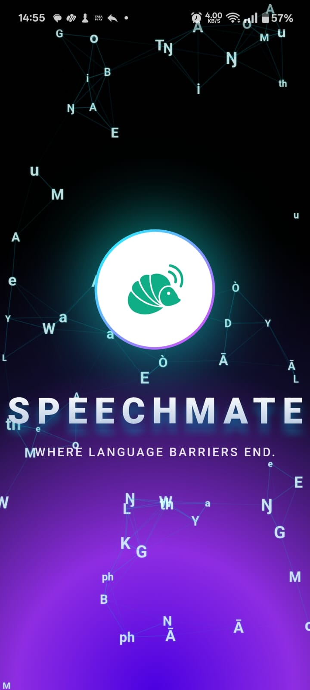
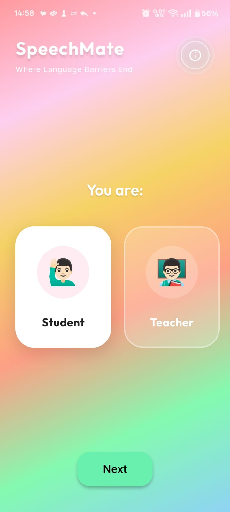
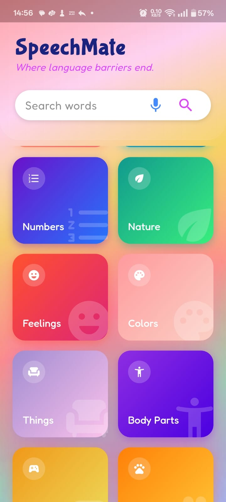
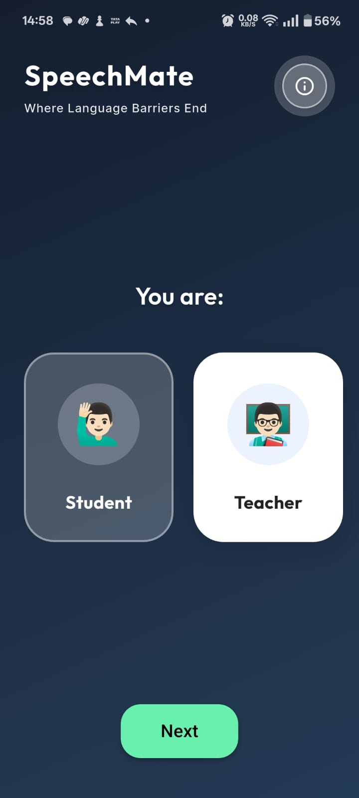
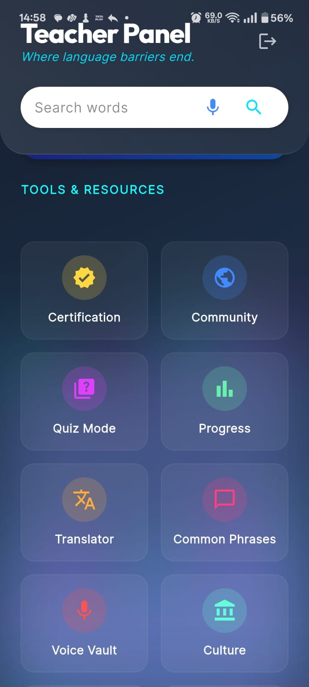
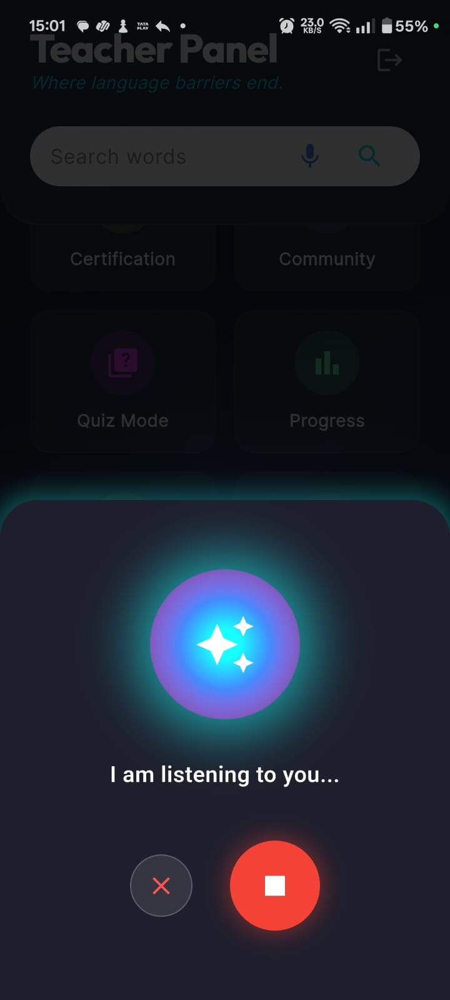
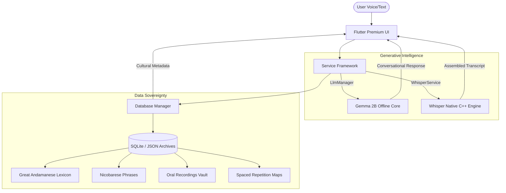

<p align="center">
  
</p>

<h1 align="center" style="font-family: 'Outfit', sans-serif; color: #2C3E50; font-size: 3em;">
  SPEECHMATE
</h1>

<p align="center">
  <strong style="font-size: 1.2em; color: #E74C3C;">"Preserving Heritage, Coding the Future."</strong>
</p>

<p align="center">
  Bridging the gap between tribal heritage and modern education using <strong>Offline Gen-AI</strong> and <strong>Indigenous Sovereignty Hub</strong>.
</p>

<p align="center">
  <a href="#">
    
  </a>
  <a href="#">
    
  </a>
  <a href="#">
    
  </a>
  <a href="#">
    
  </a>
</p>

<p align="center">
  <a href="#-demo-video">🎬 Watch Demo</a> • 
  <a href="#-apk-download">📱 Download APK</a> • 
  <a href="#-performance--metrics">📊 Benchmarks</a>
</p>

---

## 🌍 The Problem: "When a language dies, a world disappears."

**Facts:**
*   Every **14 days**, an indigenous language dies.
*   Languages like **Nicobarese** (Austroasiatic) and **Great Andamanese** are fading as younger generations shift to Hindi/English.
*   **70% of tribal students** face learning gaps due to language barriers in government schools.

**The Solution:**
**SpeechMate** is an indigenous-first **Digital Sovereignty Hub**. It is not just a dictionary; it is a **Universal Education & Preservation Platform** designed to support **any tribal language**. It works **100% Offline** in remote islands, combining native performance with an advanced **Generative AI Assistant** to teach and translate indigenous dialects.

---

## 📱 Advanced Core Features

| Feature | What It Does | Underlying Tech |
| :--- | :--- | :--- |
| **🧠 Gemma Gen-AI Core** | Advanced offline conversational AI (Optional download). | **Gemma 2B (On-Device)** |
| **🎙️ Whisper Pro STT** | High-precision English-to-Tribal speech transcription. | **Whisper Tiny/Base (Native C++)** |
| **🌿 Indigenous UI** | Glassmorphic, seasonal-adaptive themes (Dry/Rainy). | **BackdropFilter + SeasonService** |
| **🧠 Spaced Repetition** | SM-2 native scheduling for long-term word retention. | **Native SRS Engine** |
| **🗣️ Multi-Dialect** | Support for Great Andamanese, Car Nicobarese, & more. | **Relational SQLite + Lexicons** |
| **📡 P2P Knowledge Hub** | Offline vocabulary sync via ZIP payloads & QR. | **P2PSyncService** |
| **🏫 Teacher Dashboard** | Professional admin panel with automated PDF reports. | **ReportGenerator Service** |
| **🌍 Multi-Lingual UI** | Full localization for Hindi, Tamil, Malayalam, Bengali, Telugu. | **Localization Service** |

---

## 🌿 Indigenous-First Design Architecture

SpeechMate adapts to the local island environment using a **Kinship & Seasonal Engine**:

*   **Adaptive Seasonal UI**: The app's color palette and featured content change based on the local seasons (*Dry Cho* vs *Rainy Hwa*).
*   **Kinship Mapper**: Tools dedicated to visualizing and preserving complex tribal "Tuhet" (family) structures.
*   **Oral History Radio**: A dedicated hub for preserving folklore via local voice recordings (Voice Vault).

---

## 📸 Functionality Showcase

### 1. Student Experience ("Fairyland Theme")
<p align="center">
  
  
  
</p>

### 2. Teacher Admin Panel
<p align="center">
  
  
  
</p>

---

## 🏗️ Technical Architecture

SpeechMate uses a **Hybrid Architecture** combining Flutter for UI and Native Intelligence for offline inference.


```mermaid
graph TD
    User([User Voice/Text]) --> UI[Flutter Premium UI]
    UI --> Service[Service Framework]
    
    subgraph "Generative Intelligence"
        Service --> |LlmManager| Gemma[Gemma 2B Offline Core]
        Service --> |WhisperService| Whisper[Whisper Native C++ Engine]
    end
    
    subgraph "Data Sovereignty"
        Service --> DB[Database Manager]
        DB --> SQLite[(SQLite / JSON Archives)]
        SQLite --> D1[Great Andamanese Lexicon]
        SQLite --> D2[Nicobarese Phrases]
        SQLite --> D3[Oral Recordings Vault]
        SQLite --> D4[Spaced Repetition Maps]
    end
    
    Gemma --> |Conversational Response| UI
    Whisper --> |Assembled Transcript| UI
    DB --> |Cultural Metadata| UI
```

### 🧠 Why Edge AI?
*   **Zero Latency:** No server round-trip.
*   **Privacy:** Voice data never leaves the child's device.
*   **Accessibility:** Works in "Dead Zones" (Zero Signal Areas).

---

## 📊 Performance & Metrics (v1.4)

| Metric | Result | Notes |
| :--- | :--- | :--- |
| **LLM Inference** | **~2-4 tokens/sec** | On-device Gemma 2B (Mid-high range phones) |
| **STT Latency** | **< 600ms** | Optimized Whisper C++ via NDK 27 |
| **App Size** | **~85 MB** | Base app (Excluding optional 1.5GB LLM core) |
| **Offline Capability** | **100%** | Zero API calls required |

---

## 🚀 Scalability: Adding New Languages

SpeechMate is designed to be language-agnostic. Adding **Onges** or **Sentinelese** framework is modular:

1.  **Config**: Create a new `dictionary_onges.json`.
2.  **Asset**: Upload audio samples to `assets/audio/onges/`.
3.  **Theme**: update `SeasonService` for localized seasonal adjustments.

```json
// Example: Scalable JSON Structure
{
  "eng": "Water",
  "trans": "mak",
  "lang_code": "nic_car", 
  "audio": "water_car.wav"
}
```

---

## 🔮 Future Roadmap

### 🚦 Current Limitations
*   **Voice Training**: Nicobarese voice input is currently training-dependent for full generative support.
*   **Hardware requirements**: High-end LLM features require 4GB+ RAM.

### 🌟 Planned Features (v2.0+)
1.  **Bi-Directional Voice Translation**: 
    *   Fine-tuning custom **Wav2Vec 2.0** models on collected island audio recordings.
2.  **AR "Point & Learn"**:
    *   Using **ML Kit** to allow students to point cameras at physical objects to learn indigenous names.
3.  **Collaborative Classroom**:
    *   Peer-to-peer word games and knowledge sharing using **Wifi Direct / P2P Mesh**.

---

## 🛠️ Installation

1.  **Environment**: Flutter 3.20+, Android NDK 27.0.12077973.
2.  **Dependencies**: `flutter pub get`
3.  **Native Assets**: Ensure `ggml-tiny.en.bin` is placed in `assets/models/`.
4.  **Build Release APK**: `flutter build apk --release`

---

## ❤️ Real-World Impact

> **"This tool changes how we teach. Usually, English is alien to these kids. SpeechMate bridges that gap using their own mother tongue."**
> — *Primary School Teacher, Car Nicobar*

> **"SpeechMate is a lighthouse for our dying words. Seeing Great Andamanese digitalized gives our elders hope."**
> — *Community Leader, Strait Island*

---

<p align="center">
  <i>"Where Language Barriers End, Digital Sovereignty Begins."</i>
</p>
