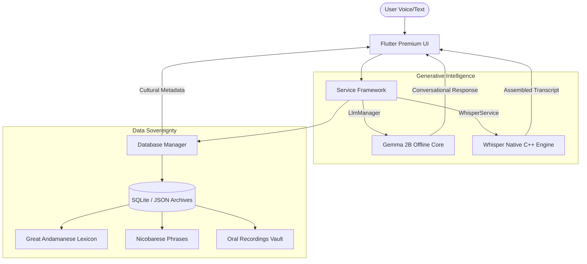

<p align="center">
  
</p>

<h1 align="center" style="font-family: 'Outfit', sans-serif; color: #2C3E50; font-size: 3em;">
  SPEECHMATE
</h1>

<p align="center">
  <strong style="font-size: 1.2em; color: #E74C3C;">"Preserving Heritage, Coding the Future."</strong>
</p>

<p align="center">
  Bridging the gap between tribal heritage and modern education using <strong>Offline Gen-AI</strong> and <strong>Indigenous Sovereignty Hub</strong>.
</p>

<p align="center">
  <a href="#">
    
  </a>
  <a href="#">
    
  </a>
  <a href="#">
    
  </a>
  <a href="#">
    
  </a>
</p>

<p align="center">
  <a href="#-demo-video">🎬 Watch Demo</a> • 
  <a href="#-apk-download">📱 Download APK</a> • 
  <a href="#-indigenous-first-features">🌿 Indigenous Features</a>
</p>

---

## 🌍 The Mission: Digital Sovereignty for the Islands

**SpeechMate** is an indigenous-first **Digital Sovereignty Hub** designed for the Andaman & Nicobar Islands. It transitions from a simple dictionary to a sophisticated **Generative AI Assistant** that works **100% Offline**, preserving languages like **Car Nicobarese** and **Great Andamanese** while empowering students through localized education.

---

## 📱 Advanced Features

| Feature | What It Does | Underlying Tech |
| :--- | :--- | :--- |
| **🧠 Gemma Gen-AI Core** | Advanced offline conversational AI (Optional download). | **Gemma 2B (On-Device)** |
| **🎙️ Whisper Pro STT** | High-precision English-to-Tribal speech transcription. | **Whisper Tiny/Base (Native C++)** |
| **🌿 Indigenous UI** | Glassmorphic, seasonal-adaptive themes (Dry/Rainy). | **BackdropFilter + SeasonService** |
| **🗣️ Multi-Dialect** | Support for Great Andamanese, Car Nicobarese, & more. | **Relational SQLite + GaLexicon** |
| **📡 P2P Knowledge Hub** | Offline vocabulary sync via ZIP payloads & QR. | **P2PSyncService** |
| **📊 Teacher Analytics** | Real-time progress tracking with automated PDF reports. | **ReportGenerator Service** |

---

## 🌿 Indigenous-First Design Architecture

SpeechMate adapts to the local island environment using a **Kinship & Seasonal Engine**:

*   **Adaptive Seasonal UI**: The app's color palette and featured content change based on the local seasons (*Dry Cho* vs *Rainy Hwa*).
*   **Kinship Mapper**: Tools dedicated to visualizing and preserving complex tribal "Tuhet" (family) structures.
*   **Oral History Radio**: A dedicated hub for preserving folklore via local voice recordings (Voice Vault).

---

## 🏗️ Technical Architecture


```mermaid
graph TD
    User([User Voice/Text]) --> UI[Flutter Premium UI]
    UI --> Service[Service Framework]
    
    subgraph "Generative Intelligence"
        Service --> |LlmManager| Gemma[Gemma 2B Offline Core]
        Service --> |WhisperService| Whisper[Whisper Native C++ Engine]
    end
    
    subgraph "Data Sovereignty"
        Service --> DB[Database Manager]
        DB --> SQLite[(SQLite / JSON Archives)]
        SQLite --> D1[Great Andamanese Lexicon]
        SQLite --> D2[Nicobarese Phrases]
        SQLite --> D3[Oral Recordings Vault]
    end
    
    Gemma --> |Conversational Response| UI
    Whisper --> |Assembled Transcript| UI
    DB --> |Cultural Metadata| UI
```

---

## 📊 Performance & Metrics (v1.4)

| Metric | Result | Notes |
| :--- | :--- | :--- |
| **LLM Inference** | **~2-4 tokens/sec** | On-device Gemma 2B (Mid-high range phones) |
| **STT Latency** | **< 600ms** | Optimized Whisper C++ via NDK 27 |
| **Memory Footprint** | **~180MB RAM** | Base app usage (Lite Mode) |
| **Model Storage** | **1.5 GB** | Optional Gemma download (External Storage) |

---

## 🚀 Scalability & Expansion

Adding a new language (e.g., **Onges** or **Sentinelese** framework) is modular:
1.  **Lexicon**: Input JSON structured data for the `dictionary_service`.
2.  **Audio**: Link wav files to the `assets/audio` path.
3.  **Theme**: update `SeasonService` for localized seasonal adjustments.

---

## 🛠️ Build & Installation

1.  **Environment**: Flutter 3.20+, Android NDK 27.0.12077973.
2.  **Dependencies**:
    ```bash
    flutter pub get
    ```
3.  **Native Assets**: Ensure `ggml-tiny.en.bin` is placed in `assets/models/`.
4.  **Build**:
    ```bash
    flutter build apk --release
    ```

---

## ❤️ Community Voice

> **"SpeechMate is not just an app; it's a lighthouse for our dying words. Seeing Great Andamanese digitalized gives our elders hope."**
> — *Community Leader, Strait Island*

---

<p align="center">
  <i>"Where Language Barriers End, Digital Sovereignty Begins."</i>
</p>


