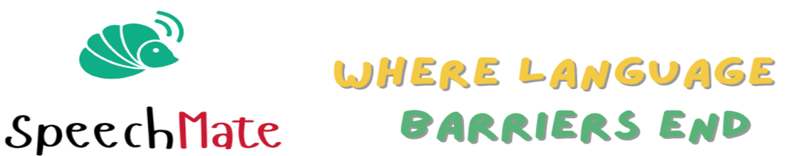
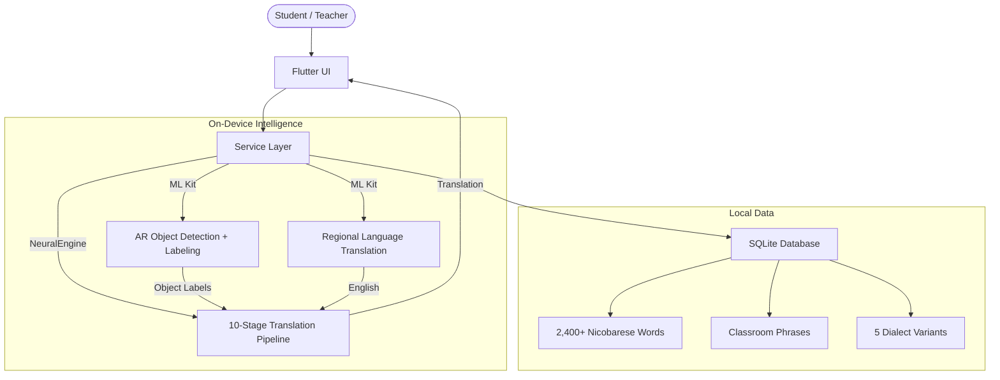

<p align="center">
  
</p>

<h1 align="center">SPEECHMATE</h1>

<p align="center">
  <strong>The only offline language learning platform for Nicobarese-speaking tribal schools.</strong>
</p>

<p align="center">
  <a href="#">
    
  </a>
  <a href="#">
    
  </a>
  <a href="#">
    
  </a>
  <a href="#">
    
  </a>
  <a href="#">
    
  </a>
</p>

<p align="center">
  <a href="#-the-problem">🌍 Problem</a> •
  <a href="#-who-its-for">👩‍🏫 Who It's For</a> •
  <a href="#-what-it-does">✨ What It Does</a> •
  <a href="#-how-it-works">🏗️ How It Works</a> •
  <a href="#-roadmap">🛤️ Roadmap</a> •
  <a href="#-installation">🚀 Install</a>
</p>

---

## 🌍 The Problem

**30,000 children** in the Andaman & Nicobar Islands speak Car Nicobarese at home but are taught exclusively in Hindi and English at school. The result:

- **Language death:** Car Nicobarese is classified as *vulnerable* by UNESCO. Younger generations are losing fluency.
- **Learning gaps:** Students who don't understand the language of instruction fall behind — particularly in primary grades (6–12 years old).
- **Zero digital tools:** There are no apps, no websites, and no digital dictionaries for Nicobarese. Teachers improvise with handwritten word lists.

**SpeechMate closes this gap.** It gives tribal school teachers a ready-to-use, offline-first learning platform that works on ₹6,000 Android phones with no internet connection.

---

## 👩‍🏫 Who It's For

### Primary User: Tribal School Teachers
Government-employed primary school teachers in Andaman & Nicobar Islands (ages 25–45) who speak Hindi/Tamil and want to teach Nicobarese vocabulary to their students but have no digital tools to do so.

### End User: Students (ages 6–12)
Children in tribal primary schools who learn best through interactive games, visual scanning, and audio-first content — not textbooks.

### Buyer: Government Education Departments
The Department of Tribal Welfare (A&N Administration), TISS, and state education boards who fund and deploy learning tools in tribal schools.

| Role | How SpeechMate Serves Them |
| :--- | :--- |
| **Teacher** | Dashboard with word management, progress reports, TTS playback, and quiz tools |
| **Student** | Interactive word games, AR object scanner, audio pronunciation, XP rewards |
| **Government** | Offline-deployable APK, usage analytics, compliance with tribal education mandates |

---

## ✨ What It Does

SpeechMate is a **single-purpose tool**: teach Nicobarese vocabulary to primary school students using interactive, offline methods.

### Core Learning Features
| Feature | What It Does | Why It Matters |
| :--- | :--- | :--- |
| **📚 12 Word Categories** | Numbers, Nature, Animals, Colors, Body Parts, Family, and more — all with audio | Students learn words in context, not isolation |
| **📷 AR Object Scanner** | Point phone camera at real objects → see Nicobarese translation overlaid | Contextual learning — links words to the physical world |
| **🎲 4 Word Games** | Word Match, Flash Cards, Scramble, Word Runner | Game-based retention — students play voluntarily |
| **🔊 Audio-First Playback** | Every word has native `.mp3` pronunciation + TTS fallback | Correct pronunciation for a primarily oral language |
| **🇮🇳 5 Regional Translators** | Hindi, Tamil, Bengali, Telugu (offline), Malayalam (online) | Teachers who speak regional languages can look up Nicobarese equivalents |
| **📖 Flashcard SRS** | SM-2 spaced repetition system | Long-term vocabulary retention |
| **🎯 Daily Missions** | "Learn 5 nature words today" — changes daily | Builds daily habit loops for students |

### Teacher Tools
| Feature | What It Does |
| :--- | :--- |
| **📊 Progress Dashboard** | Track class-wide learning progress and streaks |
| **📝 Common Phrases** | Pre-built classroom phrase bank with audio |
| **🏆 Certification Levels** | 10 structured proficiency levels with unlock progression |
| **📄 Document Translator** | Translate English curriculum PDFs to Nicobarese offline |
| **📡 P2P Sync** | Share vocabulary packs between teacher devices via offline ZIP export |

### What Makes It Different
| Claim | Evidence |
| :--- | :--- |
| **100% offline** | No internet required. Works in Andaman & Nicobar signal dead zones. |
| **Runs on cheap phones** | Optimized for Android 8+ devices with 2GB RAM (₹6,000 phones) |
| **Proprietary Nicobarese dataset** | 2,400+ words across 12 categories — no public equivalent exists |
| **Indigenous data sovereignty** | All linguistic data stored locally on device, never sent to cloud |

---

## 🏗️ How It Works

### Architecture

SpeechMate uses an **offline-first architecture**: Flutter UI → SQLite database → on-device ML Kit for AR/translation.


```mermaid
graph TD
    User([Student / Teacher]) --> UI[Flutter UI]
    UI --> Service[Service Layer]

    subgraph "On-Device Intelligence"
        Service --> |NeuralEngine| NLP[10-Stage Translation Pipeline]
        Service --> |ML Kit| AR[AR Object Detection + Labeling]
        Service --> |ML Kit| Regional[Regional Language Translation]
    end

    subgraph "Local Data"
        Service --> DB[SQLite Database]
        DB --> Words[2,400+ Nicobarese Words]
        DB --> Phrases[Classroom Phrases]
        DB --> Dialects[5 Dialect Variants]
    end

    NLP --> |Translation| UI
    AR --> |Object Labels| NLP
    Regional --> |English| NLP
```

### Translation Pipeline (10 stages, no cloud, no generative AI)
1. Full phrase match → 2. Bigram/Trigram matching → 3. Exact dictionary lookup → 4. Context disambiguation → 5. Stemming (15+ suffix rules) → 6. Synonym expansion (200+ mappings) → 7. Soundex phonetic match → 8. Compound word decomposition → 9. Fuzzy search (Levenshtein) → 10. Graceful fallback

### Build Modes

| Mode | APK Size | Features | Target Device |
| :--- | :--- | :--- | :--- |
| **Lean** (default) | ~50 MB | Dictionary, Games, AR, TTS | Android 8+, 2GB RAM |
| **Full** | ~250 MB | + Whisper STT, advanced NLP | Android 10+, 4GB RAM |

```bash
# Build lean (default — for school deployment)
flutter build apk --dart-define=LEAN_MODE=true

# Build full (for teacher/research devices)
flutter build apk --dart-define=LEAN_MODE=false
```

---

## 📊 Data

All linguistic data is stored in `assets/data/` and seeded into SQLite at first launch:

| File | Category | Entries |
| :--- | :--- | :--- |
| `dictionary.json` | Core Nicobarese (verbs, nouns, pronouns) | 2,400+ |
| `dictionary_numbers.json` | Numbers | ~20 |
| `dictionary_nature.json` | Nature & environment | ~30 |
| `dictionary_colors.json` | Colors | ~15 |
| `dictionary_feelings.json` | Emotions | ~20 |
| `dictionary_things.json` | Everyday objects | ~40 |
| `dictionary_body_parts.json` | Human anatomy | ~30 |
| `dictionary_animals.json` | Fauna | ~20 |
| `dictionary_magic.json` | Greetings & social words | ~25 |
| `dictionary_family.json` | Kinship & family | ~20 |
| `dictionary_great_andamanese.json` | Great Andamanese lexicon | 1,000+ |

---

## 🗣️ Supported Languages

### Interface Languages
🌴 Pū (Car Nicobarese) · 🏔️ Aka-Jeru (Great Andamanese) · 🇬🇧 English · 🇮🇳 हिंदी · தமிழ் · മലയാളം · తెలుగు · বাংলা

### Regional Translators
| Language | Engine | Mode |
| :--- | :--- | :--- |
| Hindi | Google ML Kit | ✅ Offline |
| Tamil | Google ML Kit | ✅ Offline |
| Bengali | Google ML Kit | ✅ Offline |
| Telugu | Google ML Kit | ✅ Offline |
| Malayalam | Cloud fallback | 🌐 Online |

---

## 🛤️ Roadmap

We ship in phases, not features. Each phase has a measurable success metric.

| Phase | Timeline | Goal | Success Metric |
| :--- | :--- | :--- | :--- |
| **Pilot** | Now → Month 3 | Deploy to 1 school, 20 students | 80%+ weekly app opens |
| **Validate** | Month 3–6 | Expand to 3 schools, 100 students | Teacher satisfaction > 7/10 |
| **Scale** | Month 6–9 | MOU with A&N Dept of Education | Government letter of intent |
| **Fundraise** | Month 9–12 | Secure ₹50L seed / CSR grant | 500 active students, 10 schools |

### Completed
- [x] 12 word categories with audio
- [x] AR object scanner with real-time translation overlay
- [x] 4 interactive word games
- [x] 5 regional language translators (offline)
- [x] Great Andamanese standalone hub
- [x] Teacher dashboard with progress tracking
- [x] SM-2 spaced repetition flashcards
- [x] Offline document translation (PDF/TXT)
- [x] P2P vocabulary sync (ZIP export)
- [x] Gamification engine (XP, streaks, daily missions)

### Planned (after pilot validation)
- [ ] Community recording program (tribal elder pronunciation)
- [ ] Teacher certification system
- [ ] Onges language module
- [ ] Cloud sync for community posts (optional)

---

## 💰 Sustainability Model

Cultural data is not monetized. The **software and deployment services** sustain the project.

| Tier | Target | Price | Deliverable |
| :--- | :--- | :--- | :--- |
| **School License** | Dept of Tribal Welfare | ₹2,000–₹5,000/school/year | Offline APK + Teacher admin |
| **NGO Package** | UNESCO, Azim Premji, Aga Khan | ₹50K–₹2L/project | Custom vocabulary + onboarding |
| **Research License** | CIIL, SIL International | Grant-based | Anonymized usage data |

---

## 🚀 Installation

```bash
# 1. Clone
git clone https://github.com/sathiyatskrj/Speechmate.git
cd Speechmate

# 2. Install dependencies
flutter pub get

# 3. Pull ML models (Git LFS)
git lfs pull

# 4. Run
flutter run

# 5. Build lean APK for school deployment
flutter build apk --dart-define=LEAN_MODE=true
```

**Requirements:** Flutter 3.29+ · Dart 3.2+ · Android NDK 27 · Android SDK 34

---

## 📜 License & Indigenous Data Sovereignty

Licensed under **Apache 2.0 with Cultural Non-Commercial Restriction**.

The software architecture is open-source. The **linguistic datasets, dictionaries, audio files, and cultural artifacts** belonging to the Nicobarese, Great Andamanese, and other tribal groups may not be used, sold, or monetized without explicit written consent from the appropriate tribal councils.

---

<p align="center">
  Built with ❤️ for the tribal communities of the Andaman & Nicobar Islands
</p>
