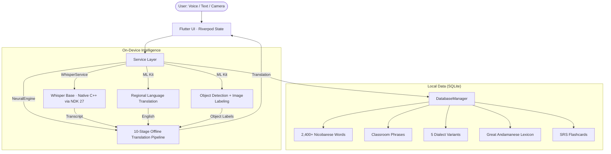

<p align="center">
  
</p>

<h1 align="center">SPEECHMATE</h1>

<p align="center">
  <strong>An offline-first language learning platform for endangered Nicobarese and Great Andamanese languages.</strong>
</p>

<p align="center">
  <a href="#">
    
  </a>
  <a href="#">
    
  </a>
  <a href="#">
    
  </a>
  <a href="#">
    
  </a>
  <a href="#">
    
  </a>
  <a href="#">
    
  </a>
</p>

<p align="center">
  <a href="#-the-problem">🌍 Problem</a> •
  <a href="#-who-its-for">👩‍🏫 Who It's For</a> •
  <a href="#-core-features">✨ Features</a> •
  <a href="#-technical-architecture">🏗️ Architecture</a> •
  <a href="#-language-modules">🗣️ Languages</a> •
  <a href="#-roadmap">🛤️ Roadmap</a> •
  <a href="#-installation">🚀 Install</a>
</p>

---

## 🌍 The Problem

Languages like **Car Nicobarese** (Austroasiatic) and **Great Andamanese** (language isolate) are critically endangered. Younger generations in the Andaman & Nicobar Islands are shifting to Hindi and English, and there are **no existing digital tools** for learning these indigenous languages.

- Every **14 days**, an indigenous language dies globally.
- Students who don't understand the medium of instruction face significant learning gaps.
- The Andaman & Nicobar Islands have **zero dedicated digital tools** for tribal language education.

**SpeechMate** is a **pre-pilot prototype** of an offline-first language learning platform designed to address this gap. It works 100% offline — critical for remote island communities with limited connectivity.

> **Current Status:** This is a functional prototype. It has not yet been deployed in schools or validated with end users. The next milestone is a pilot deployment with a small number of schools.

---

## 👩‍🏫 Who It's For

| Role | Description |
| :--- | :--- |
| **Primary School Teachers** | Government-employed tribal school teachers (A&N Islands) who need digital tools to teach Nicobarese vocabulary |
| **Students (ages 6–14)** | Children in tribal primary schools who learn through interactive games, visual content, and audio |
| **Government / NGOs** | Dept of Tribal Welfare, education boards, and NGOs seeking deployable tribal education tools |

---

## ✨ Core Features

### 🎓 Student Dashboard
| Module | Description |
| :--- | :--- |
| **📚 12 Learning Categories** | Numbers, Nature, Feelings, Colors, Things, Body Parts, Animals, Magic Words, Family, and more — loaded from Nicobarese JSON lexicons |
| **📷 AR Translator** | Real-time object and text translator using Google ML Kit with an AR overlay showing Nicobarese translations on detected objects. Features 3 lens modes (Auto/Objects/Text) and dynamic FPS-aware throttling |
| **🎙️ Whisper STT Engine** | On-device speech-to-text using Whisper Base (`ggml-base.bin`, 141MB) for offline voice translation, optimized with a fast-path local audio shortcut layer for zero-latency common phrase matching |
| **🔊 Audio Playback** | Native `.mp3` pronunciation for each word; TTS fallback when audio files are unavailable |
| **🧩 Games Hub** | Word Match, Flash Cards, Word Scramble, and Word Runner — gamified vocabulary learning |
| **💬 Chat Translator** | Conversational translation interface powered by offline dictionary lookup + NLP heuristics |
| **🗂️ Voice Vault** | Record and preserve oral history and folklore recordings |
| **🌍 Community Hub** | Shared learning feed connecting students and educators |
| **🏝️ Island Explorer** | Custom-painted Andaman & Nicobar map showing dialect distribution zones |
| **📖 Flashcard SRS** | SM-2 spaced repetition system for long-term vocabulary retention |
| **🌐 8-Language UI** | Interface localized in Nicobarese, Great Andamanese, English, Hindi, Tamil, Malayalam, Telugu, Bengali |
| **🇮🇳 Regional Translators** | Bidirectional translation: Nicobarese ↔ Hindi, Tamil, Bengali, Telugu (offline via ML Kit) and Malayalam (online fallback) |
| **🔎 Multilingual Search** | Type in any regional language script — auto-translates to English before Nicobarese lookup |

### 🧒 Gamification Engines
| Engine | Description |
| :--- | :--- |
| **XP & Leveling** | 11 named levels (Seedling → Elder) with streak multipliers |
| **Daily Missions** | Deterministic daily goal selector (e.g., "Learn 5 nature words") — no storage required |
| **Quick Stats** | Live streak, stars, and level display from SharedPreferences |
| **Confetti System** | Physics-based particle effects on achievements |
| **Virtual Pet** | **Tamagotchi-inspired companion** with dynamic mood states (hunger, energy, happiness), XP-driven evolution (egg → legendary), interactive behaviors (feeding, zoomies, sleeping), and speech bubbles |
| **Voice Waveform** | Animated audio visualizer |

### 👩‍🏫 Teacher Dashboard
| Module | Description |
| :--- | :--- |
| **🎤 Voice Search** | Whisper-powered voice-to-search for vocabulary lookup |
| **📝 Common Phrases** | Pre-built classroom phrase bank with audio |
| **🏆 Certification Levels** | 10 structured proficiency levels with unlock progression |
| **🧪 Quiz Mode** | Adaptive vocabulary quiz with missed-word re-injection |
| **📊 Progress Analytics** | Class-level progress tracking and spaced repetition dashboards |
| **📷 Book Scanner (OCR)** | ML Kit camera scanner to translate printed English text to Nicobarese |
| **🗣️ Voice Translator** | Real-time multilingual voice translation |
| **🌿 Nature Hub** | Flora & fauna database with indigenous names and traditional uses |
| **📻 Oral History Radio** | Tribal storytelling archive |
| **🗺️ Tuhet Mapper** | Kinship structure visualization for indigenous family trees |
| **🌐 Dialect Comparison** | Side-by-side comparison across Car, Central, Coast, Teressa & Chowra dialects |
| **📄 Document Translation** | Offline PDF/TXT parser to translate English curriculum to Nicobarese |
| **📡 P2P Sync** | Export/import vocabulary packs via offline ZIP payloads |

---

## 🗣️ Language Modules

### Interface Languages
🌴 Pū (Car Nicobarese) · 🏔️ Aka-Jeru (Great Andamanese) · 🇬🇧 English · 🇮🇳 हिंदी · தமிழ் · മലയாളം · తెలుగు · বাংলা

### Regional Translators
| Language | Engine | Mode |
| :--- | :--- | :--- |
| **Hindi** | Google ML Kit | ✅ Offline |
| **Tamil** | Google ML Kit | ✅ Offline |
| **Bengali** | Google ML Kit | ✅ Offline |
| **Telugu** | Google ML Kit | ✅ Offline |
| **Malayalam** | `translator` package (cloud) | 🌐 Online |

**Pipeline:** Regional Text → English (ML Kit / Cloud) → Nicobarese (Offline Dictionary + NLP Engine)

### 🏝️ Great Andamanese Hub
A standalone module with 4 tabs:
| Tab | Feature |
| :--- | :--- |
| **📖 Dictionary** | Searchable GA lexicon with POS filters + TTS |
| **🔤 Translator** | English → Great Andamanese (exact match + word-by-word fallback) |
| **🎙️ Voice** | Whisper transcription → auto-translation to GA |
| **📷 OCR Scanner** | Scan printed English text → translate to GA |

---

## 🏗️ Technical Architecture

Offline-first architecture: Flutter UI → SQLite database → on-device ML Kit for AR/translation.


```mermaid
graph TD
    User([User: Voice / Text / Camera]) --> UI[Flutter UI · Riverpod State]
    UI --> Service[Service Layer]

    subgraph "On-Device Intelligence"
        Service --> |WhisperService| Whisper[Whisper Base · Native C++ via NDK 27]
        Service --> |NeuralEngine| NLP[10-Stage Offline Translation Pipeline]
        Service --> |ML Kit| AR[Object Detection + Image Labeling]
        Service --> |ML Kit| Regional[Regional Language Translation]
    end

    subgraph "Local Data (SQLite)"
        Service --> DB[DatabaseManager]
        DB --> Words[2,400+ Nicobarese Words]
        DB --> Phrases[Classroom Phrases]
        DB --> Dialects[5 Dialect Variants]
        DB --> GA[Great Andamanese Lexicon]
        DB --> FC[SRS Flashcards]
    end

    Whisper --> |Transcript| NLP
    Regional --> |English| NLP
    NLP --> |Translation| UI
    AR --> |Object Labels| NLP
```

### Offline Translation Pipeline (10 stages)
1. **Full Phrase Match** — Complete sentence lookup
2. **Bigram Matching** — 2-word compound phrase lookup
3. **Trigram Matching** — 3-word compound phrase lookup
4. **Exact Dictionary Lookup** — O(1) indexed SQLite match
5. **Context Disambiguation** — Resolves ambiguous words based on surrounding tokens
6. **Stemming** — 15+ English suffix rules
7. **Synonym Expansion** — 200+ curated synonym mappings
8. **Soundex Phonetic Match** — Catches misspellings by sound similarity
9. **Compound Word Decomposition** — Splits compound words (e.g., "rainforest" → "rain" + "forest")
10. **Fuzzy Search** — Levenshtein edit-distance matching (max distance: 2)

> All translation is performed via dictionary lookups + algorithmic NLP. No generative AI or neural networks are used.

### Why Fully Offline?
- **Accessibility** — Works in signal dead zones across remote Andaman & Nicobar islands
- **Privacy** — Voice recordings never leave the device
- **Sovereignty** — Indigenous linguistic data is stored locally, not by a cloud provider
- **Speed** — No server round-trips; responses are instantaneous

---

## 📊 Technical Specs

| Metric | Value | Notes |
| :--- | :--- | :--- |
| App Size | ~250 MB | Includes 141MB Whisper model |
| STT Latency | < 600ms | Whisper Base via NDK 27 C++ |
| Translation Speed | < 100ms | Local SQLite indexed queries |
| Dictionary | 2,400+ entries | Core Nicobarese lexicon |
| GA Lexicon | 277KB+ | Great Andamanese standalone |
| Regional Languages | 5 | Hindi, Tamil, Bengali, Telugu (offline), Malayalam (online) |
| Offline Capability | 100% | Core features work without internet |
| Min Android | API 24 | Android 7.0+ |
| Target SDK | API 33 | Android 13 |

---

## 📂 Data

All linguistic data is in `assets/data/` and seeded into SQLite at first launch:

| File | Category | Entries |
| :--- | :--- | :--- |
| `dictionary.json` | Core Nicobarese | 2,400+ |
| `dictionary_numbers.json` | Numbers | ~20 |
| `dictionary_nature.json` | Nature | ~30 |
| `dictionary_colors.json` | Colors | ~15 |
| `dictionary_feelings.json` | Emotions | ~20 |
| `dictionary_things.json` | Everyday objects | ~40 |
| `dictionary_body_parts.json` | Body parts | ~30 |
| `dictionary_animals.json` | Animals | ~20 |
| `dictionary_magic.json` | Greetings | ~25 |
| `dictionary_family.json` | Family | ~20 |
| `dictionary_phrases.json` | Classroom phrases | ~30 |
| `dictionary_dialects.json` | 5-dialect comparison | large |
| `dictionary_great_andamanese.json` | Great Andamanese | 1,000+ |

---

## 🚀 Adding New Languages

SpeechMate is language-agnostic by design:

1. Create `assets/data/dictionary_<lang>.json`
2. Add audio to `assets/audio/<lang>/`
3. Register in `main.dart` → `seedCategoryFromJson()`
4. Add a tile in `app_language_select.dart`

```json
{
  "english": "Water",
  "nicobarese": "Mak",
  "emoji": "💧",
  "audio": "water.mp3"
}
```

---

## 🛤️ Roadmap

**Current stage: Pre-pilot prototype.** All features below are built and functional but have not yet been validated with end users.

### Completed (Prototype)
- [x] 12 word categories with native audio
- [x] AR object scanner with real-time translation overlay
- [x] 4 interactive word games with XP system
- [x] 5 regional language translators (4 offline, 1 online)
- [x] Great Andamanese standalone hub
- [x] Teacher dashboard with progress tracking
- [x] SM-2 spaced repetition flashcards
- [x] Offline document translation (PDF/TXT)
- [x] P2P vocabulary sync (ZIP export)
- [x] Gamification engines (XP, missions, confetti, virtual pet)
- [x] On-device Whisper STT
- [x] 10-stage offline translation pipeline
- [x] Kid-friendly UI optimized for low-end devices

### Next Steps (Validation)
- [ ] Pilot deployment in 1–3 A&N tribal schools
- [ ] Collect teacher feedback and student usage metrics
- [ ] Community recording program (tribal elder pronunciations)
- [ ] Teacher certification system
- [ ] Lean APK build mode (<50MB, without Whisper)

### Future (Post-Validation)
- [ ] Onges language module
- [ ] On-device LLM for generative chat (SmolLM2 GGUF)
- [ ] Cloud sync for community posts
- [ ] Gamified printable certificates

---

## 💰 Sustainability

Cultural data is not monetized. The software and deployment services sustain the project.

| Tier | Target Buyer | Model |
| :--- | :--- | :--- |
| **School License** | Dept of Tribal Welfare | ₹2,000–₹5,000/school/year |
| **NGO Package** | UNESCO, Azim Premji, Aga Khan | ₹50K–₹2L/project |
| **Research License** | CIIL, SIL International | Grant-based |

---

## 🛠️ Installation

```bash
# 1. Clone
git clone https://github.com/sathiyatskrj/Speechmate.git
cd Speechmate

# 2. Install dependencies
flutter pub get

# 3. Pull ML models (Git LFS)
git lfs pull
# Ensures assets/models/ggml-base.bin (141MB) is downloaded

# 4. Run
flutter run

# 5. Build release APK
flutter build apk --release
```

**Requirements:** Flutter 3.29+ · Dart 3.2+ · Android NDK 27 · Android SDK 34

---

## 📜 License & Indigenous Data Sovereignty

Licensed under **Apache 2.0 with Cultural Non-Commercial Restriction**.

The software architecture is open-source. The **linguistic datasets, dictionaries, audio files, and cultural artifacts** belonging to the Nicobarese, Great Andamanese, and other tribal groups may not be used, sold, or monetized without explicit written consent from the appropriate tribal councils or governmental bodies.

---

<p align="center">
  Built with ❤️ for the tribal communities of the Andaman & Nicobar Islands
</p>
