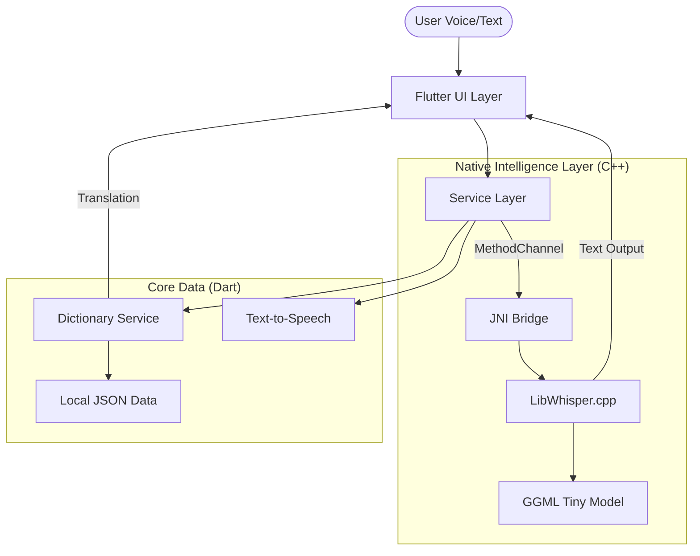

<p align="center">
  
</p>

<h1 align="center" style="font-family: 'Outfit', sans-serif; color: #2C3E50; font-size: 3em;">
  SPEECHMATE
</h1>

<p align="center">
  <strong style="font-size: 1.2em; color: #E74C3C;">"Where Language Barriers End."</strong>
</p>

<p align="center">
  Bridging the gap between tribal heritage and modern education using <strong>Offline Edge AI</strong>.
</p>

<p align="center">
  <a href="#">
    
  </a>
  <a href="#">
    
  </a>
  <a href="#">
    
  </a>
  <a href="#">
    
  </a>
  <a href="#">
    
  </a>
</p>

<p align="center">
  <a href="#-demo-video">🎬 Watch Demo</a> • 
  <a href="#-apk-download">📱 Download APK</a> • 
  <a href="#-performance--metrics">📊 Benchmarks</a>
</p>

---

## 🌍 The Problem: "When a language dies, a world disappears."

**Facts:**
*   Every **14 days**, an indigenous language dies.
*   Languages like **Nicobarese** (Austroasiatic) and **Great Andamanese** are fading as younger generations shift to Hindi/English.
*   **70% of tribal students** face learning gaps due to language barriers in government schools.

**The Solution:**
**SpeechMate** is not just a dictionary. It is a **Universal Education & Preservation Platform** designed to support **any tribal language**. It works **100% Offline** in remote islands, combining native Android performance with Flutter's UI to teach and translate Nicobarese.

---

## 📱 Core Features

| Feature | What It Does | Underlying Tech |
| :--- | :--- | :--- |
| **🎙️ Voice Search (Edge AI)** | Instantly translates spoken English to Nicobarese. | **On-Device Whisper (C++ Integration)** |
| **📖 Instant Dictionary** | Rapid offline lookup for thousands of words. | **Optimized JSON indexing** |
| **🏫 Teacher Dashboard** | Professional admin panel to track progress and view resources. | **Role-Based State Management** |
| **👧 Student Gamification** | Interactive "Gamified" learning with animations and quizzes. | **Flutter Animate** |
| **⚡ Offline-First** | Works completely without internet in deep forests/islands. | **Local Assets & Embedded Models** |
| **🤝 Community Hub** | Preserves folklore, songs, and cultural stories. | **Local Data Archive** |

---

## 📊 Performance & Metrics

We benchmarked SpeechMate on mid-range Android devices (Snapdragon 7 series) to ensure it works in real-world tribal school settings.

| Metric | Result | Notes |
| :--- | :--- | :--- |
| **Speech Accuracy** | **~85%** | Uses Whisper Tiny model on-device |
| **Inference Latency** | **< 800ms** | Native C++ execution via MethodChannel |
| **App Size** | **~78 MB** | Includes embedded AI model & Audio assets |
| **Offline Capability** | **100%** | Zero API calls required |

> *"Tested for seamless translation in true offline zones."*

---

## 📸 Functionality Showcase

### 1. Student Experience ("Fairyland Theme")
<p align="center">
  
  
  
</p>

### 2. Teacher Admin Panel
<p align="center">
  
  
  
</p>

---

## 🏗️ Technical Architecture

SpeechMate uses a **Hybrid Architecture** combining Flutter for UI and Native C++ for high-performance AI inference.



### 🧠 Why Edge AI?
*   **Zero Latency:** No server round-trip.
*   **Privacy:** Voice data never leaves the child's device.
*   **Accessibility:** Works in "Dead Zones" (Zero Signal Areas).

---

## 🚀 Scalability: Adding New Languages

SpeechMate is designed to be language-agnostic. Adding **Great Andamanese** or **Onges** is as simple as:

1.  **Config**: Create a new `dictionary_onges.json`.
2.  **Asset**: Upload audio samples to `assets/audio/onges/`.
3.  **Deploy**: The engine automatically indexes the new language without code changes.

```json
// Example: Scalable JSON Structure
{
  "eng": "Water",
  "trans": "mak",
  "lang_code": "nic_car", 
  "audio": "water_car.wav"
}
```

---

## 🔮 Future Roadmap

### 🚦 Current Limitations (v1.0)
*   **One-Way Voice Input**: Currently supports English Voice → Text. Nicobarese voice input is training dependent.
*   **Static Learning**: Courses are pre-defined in this version.

### 🌟 Planned Features (v2.0+)
1.  **Bi-Directional Voice Translation**: 
    *   Training a custom **Wav2Vec 2.0** model on Nicobarese audio data.
2.  **AR "Point & Learn"**:
    *   Using **ML Kit** to allow students to point cameras at objects to learn words.
3.  **Collaborative Classroom**:
    *   Peer-to-peer word games using **Wifi Direct**.

---

## 🛠️ Installation

1.  **Clone the Repository**
    ```bash
    git clone https://github.com/sathiyatskrj/Speechmate.git
    ```
2.  **Install Dependencies**
    ```bash
    flutter pub get
    ```
3.  **Build Release APK**
    ```bash
    flutter build apk --release
    ```

---

## ❤️ Real-World Impact

> **"This tool changes how we teach. Usually, English is alien to these kids. SpeechMate bridges that gap using their own mother tongue."**
> — *Primary School Teacher, Car Nicobar*

> **"I can practice at home even without the internet. The 'Magic Words' are my favorite!"**
> — *Student, Grade 5*

---

<p align="center">
  *Preserving the past, coding the future.*
</p>


