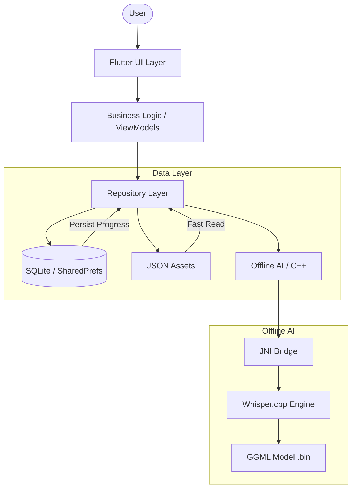

# Architecture - Clean & Offline First

```mermaid
graph TD
    User([User]) --> UI[Flutter UI Layer]
    UI --> Logic[Business Logic / ViewModels]
    Logic --> Repo[Repository Layer]
    
    subgraph Data Layer
        Repo --> LocalDB[(SQLite / SharedPrefs)]
        Repo --> Assets[JSON Assets]
        Repo --> Whisper[Offline AI / C++]
    end
    
    subgraph Offline AI
        Whisper --> JNI[JNI Bridge]
        JNI --> CPP[Whisper.cpp Engine]
        CPP --> Model[GGML Model .bin]
    end
    
    Assets -- "Fast Read" --> Repo
    LocalDB -- "Persist Progress" --> Repo
```
