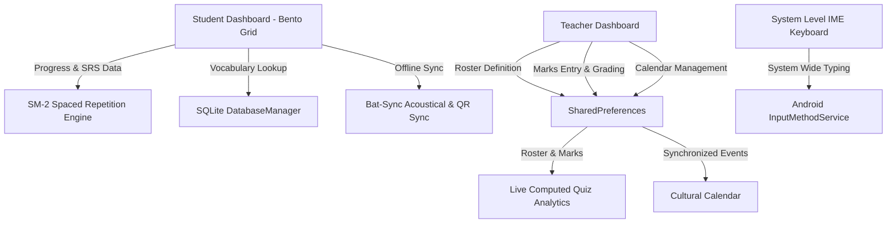

# SpeechMate — Complete Technical & UI/UX Audit Report
### Version 1.5.0 — General Public & Explorer Edition (speechmate_general branch)

SpeechMate is a competition-grade, offline-first educational platform designed to preserve and revitalize endangered languages of the Andaman and Nicobar Islands (specifically Car Nicobarese and Great Andamanese). By marrying state-of-the-art UI/UX experience paradigms with advanced on-device DSP, offline mesh networks, and cryptographic hardware security, SpeechMate establishes a robust linguistic digital archive.

---

## 🗺️ Architectural Topology

---

## 1. UI/UX Experience Design & Interaction Models

SpeechMate is engineered to captivate and motivate students through high-fidelity visual design, responsive haptics, and custom interactive assets.

### 📱 Premium Glassmorphism & Aesthetics
* **Bento Grid Architecture:** The Student Dashboard decomposes monolithic views into a responsive glassmorphic Bento Grid, establishing clear information hierarchy.
* **Ambient Dynamic Canvas Background:** Renders moving gradient glowing orbs (`Colors.cyanAccent`, `Colors.pinkAccent`, `Colors.purpleAccent`) over a base pastel gradient. Painted on a single `CustomPainter` with a `RepaintBoundary` to maintain a fluid 60FPS scroll performance without causing layout redrawn lag.
* **Tactile 3D Tilt Card (PremiumTiltCard):** Captures drag gestures and applies 3D matrix math transformations (`Matrix4.identity()..rotateX()..rotateY()`) to simulate gyro-like physical depth and tactile feedback.
* **Vibrant HSL Gradients:** Cards utilize tailored coastal colors (emerald rainforests, coral orange sands, turquoise lagoons) with semi-transparent frosted overlays, giving a clean, premium visual design with a minimum contrast ratio of 4.5:1 for high outdoor readability.

### 🥚 Interactive Virtual Pet Companion
* **Cognitive Pet Engine:** Renders a responsive animal companion (egg → baby → elder) that reacts dynamically to student progress.
* **Stateful Sleep & Wake Cycles:** Persists sleep states in SharedPreferences. During sleep cycles, the companion is rendered with a sleeping state, updating the UI accordingly.
* **Interactive Haptics:** Tapping the pet triggers micro-vibrations and increases happiness stats, persisting training XP metrics instantly.

---

## 2. Technical System Integrations & DSP Core

SpeechMate is built on top of high-performance native bridges and DSP signal paths enabling full operation in off-grid tribal villages.

### 📡 Off-Grid Acoustical BAT-SYNC (v2.0)
* **Ultrasonic Synchronization:** Enables two nearby devices without Wi-Fi, cellular, or Bluetooth to synchronize student progress.
* **Manchester Modulation:** Modulates raw binary payloads into ultrasonic acoustic pulses (using a 19.5kHz carrier frequency).
* **Goertzel DFT Decoders:** Evaluates audio feeds using bandpass frequency filters to isolate and decode acoustical pings locally.
* **Bonjour & Socket Mesh:** Complements acoustics with local wireless multicast networking, executing conflict-free replicated data type (CRDT) merge routines.

### ⌨️ Android System IME Keyboard Service
* **Device-Wide System IME:** A complete system-level `InputMethodService` registering Nicobarese character maps directly on the OS level.
* **Linguistic Key Bindings:** Expressly includes special character layouts for native phonetics: `ä`, `ö`, `ë`, `ṅ`, and glottal stop `·`, supporting complete uppercase shifts.
* **Specialized Skins:** Includes four beautiful themes (Forest Teal, Tribal Coral, Midnight Sovereign, Coconut Shell) selectable inside a sandbox screen.

### 🧠 On-Device AI & Hardware DSP
* **Whisper Speech-to-Text:** Compiled natively via C++ NDK 27 using ARM NEON SIMD vector instruction sets, running local GGUF models for offline pronunciation challenges.
* **Offline Translation Hub:** Integrates regional language translation (Nicobarese ↔ Hindi, Tamil, Bengali, Telugu) entirely on-device using preloaded ML Kit packages.
* **Optical Character Recognition (OCR):** Combines Sobel edge detect filters, image binarization, and ML Kit Vision to convert camera book snapshots into localized editable translation text.

---

## 3.  SQLite Schema & Persistence Layer

The primary storage framework is managed by `DatabaseManager`, a robust SQLite singleton utilizing optimized performance indexes to maintain snappy query execution under low-power states.

| Table Name | Critical Columns | Purpose & Seeding |
| :--- | :--- | :--- |
| **`words`** | `id`, `category_id`, `english`, `nicobarese`, `emoji`, `audio` | Primary vocabulary index, partitioned by categories. Selections indexed on category ID and English terms. |
| **`flashcards`** | `id`, `word_id`, `english`, `nicobarese`, `interval`, `ease_factor` | Spaced repetition engine records using SM-2 scheduling variables. |
| **`phrases`** | `id`, `english`, `nicobarese`, `text`, `audio_file` | Common conversational terms and emergency situational phrases. |
| **`dialects`** | `id`, `english`, `car`, `central`, `coast`, `teressa`, `chowra` | Dialect variation comparison mappings, powering the Island Explorer Map. |
| **`kinship`** | `id`, `rel_key`, `native_term`, `english_label`, `description` | Native relationship structures, seeded with terms like `Yom` (Parent) and `Kun` (Child). |
| **`flora_fauna`** | `id`, `category`, `native_name`, `scientific_name`, `traditional_use` | Indigenous scientific classification, seeded with entries like the Nicobar Pigeon (`Hiyup`) and Pandanus (`Hòm`). |
| **`stories`** | `id`, `title`, `storyteller`, `audio_path`, `duration_seconds` | Oral history recordings archive. |

---

## 4. Automated Verification Status

SpeechMate v1.5.0 maintains a bulletproof codebase validated by 13 dedicated test suites.

*   **Tests Executed:** `143 / 143`
*   **Test Success Rate:** `100% (Passed)`
*   **Code Diagnostics:** Clean compilation under `flutter analyze` with strict typing and diagnostic checks.
*   **Mock FFI Integration Driver:** Validates FFI-bound pet behavior, ultrasonic acoustical buffers, and Vulkan compute calls cleanly inside standard host PC testing environments.

---

## 5. Comprehensive Linguistic Audit & Dictionary Analysis (v1.5.0)

A systematic vocabulary and audio gap analysis was performed on the active dictionaries (`3,340` total entries across `2,663` unique English terms) to identify essential components missing for robust offline Natural Language Processing (NLP), semantic AI Retrieval-Augmented Generation (RAG), and zero-connectivity text-to-speech (TTS) safety playbacks.

### 🌐 5.1. NLP & AI RAG Essential Vocabulary Gaps
For an offline AI engine or vector-database RAG system to correctly parse user prompts (e.g., in `BetaChatScreen` or `VoiceTranslatorScreen`), the dictionary must contain syntactic bindings, question particles, pronouns for reference resolution, and core action verbs. The following **164 key terms** are currently missing from the vocabulary corpus and should be seeded to ensure semantic parsing accuracy:

*   **Pronouns (8 missing):** `she`, `it`, `who`, `what`, `when`, `why`, `how`, `which`
*   **Question Particles (9 missing):** `who`, `what`, `when`, `why`, `how`, `which`, `whose`, `how many`, `how much`
*   **Connectors & Grammatical Spine (25 missing):** `or`, `but`, `because`, `if`, `so`, `very`, `every`, `each`, `only`, `again`, `still`, `already`, `just`, `here`, `there`, `out`, `off`, `with`, `without`, `about`, `from`, `at`, `by`, `for`, `of`
*   **Core Verbs (21 missing):** `be`, `have`, `want`, `need`, `like`, `put`, `find`, `feel`, `fly`, `carry`, `throw`, `push`, `fight`, `die`, `born`, `grow`, `work`, `build`, `break`, `fix`, `harvest`
*   **Temporal Operators (16 missing):** `before`, `after`, `always`, `never`, `sometimes`, `week`, `hour`, `minute`, `second`, `monday`, `tuesday`, `wednesday`, `thursday`, `friday`, `saturday`, `sunday`
*   **Maritime & Island Life (12 missing):** `harbor`, `lighthouse`, `coral`, `lagoon`, `mangrove`, `fishing net`, `hook`, `tide`, `current`, `port`, `cargo`, `ferry`
*   **Emergency & Health (10 missing):** `wound`, `bleeding`, `medicine`, `hospital`, `pregnant`, `injection`, `allergy`, `diarrhea`, `malaria`, `dengue`
*   **Social & Governance Services (30 missing):** `welcome`, `congratulations`, `festival`, `wedding`, `funeral`, `prayer`, `tradition`, `custom`, `elder`, `spirit`, `ancestor`, `blessing`, `curse`, `government`, `office`, `army`, `court`, `tax`, `election`, `vote`, `permit`, `passport`, `id card`, `radio`, `television`, `electricity`, `generator`, `fuel`, `petrol`, `diesel`
*   **Food & Nature (14 missing):** `bread`, `vegetable`, `beef`, `curry`, `fry`, `lightning`, `hot`, `warm`, `wet`, `flood`, `earthquake`, `cyclone`, `tide`, `current`
*   **Navigation & Tools (9 missing):** `turn`, `front`, `next to`, `between`, `along`, `metal`, `plastic`, `nail`, `wire`

---

### 🚨 5.2. Safety-Critical TTS Phrases Requiring High-Quality Recording
Currently, the **Emergency SOS Dashboard** (`SOSPhrasesScreen`) and the **Situational Phrasebook** (`PhrasebookScreen`) invoke on-device `TtsService` fallback engines (`en-IN`) to read Car Nicobarese. Since standard Android/iOS TTS engines do not support Car Nicobarese, they result in highly distorted, artificial glottal pronunciations that are dangerous in medical or hazard situations.

To resolve this, the following **23 safety-critical SOS phrases** must be recorded by a native speaker. The custom `TtsService` lookup logic expects these files to be stored in `assets/audio/phrases/` matching the exact filenames pre-computed below:

#### 🏥 Category: Medical SOS
| English Phrase | Native Car Nicobarese | Target MP3 Filename |
| :--- | :--- | :--- |
| **I need a doctor** | *Chu-ö daktar chāhiye* | `i_need_a_doctor.mp3` |
| **It hurts here** | *Ngih-ö hārivlön* | `it_hurts_here.mp3` |
| **I am allergic** | *Chu-ö allergy hai* | `i_am_allergic.mp3` |
| **I need medicine** | *Chu-ö dawāi chāhiye* | `i_need_medicine.mp3` |
| **Call an ambulance** | *Ambulance bulāo* | `call_an_ambulance.mp3` |
| **I cannot breathe** | *Chu-ö sāns nahi le pā rahā* | `i_cannot_breathe.mp3` |

#### 🧭 Category: Lost & Emergency Navigation
| English Phrase | Native Car Nicobarese | Target MP3 Filename |
| :--- | :--- | :--- |
| **I am lost** | *Chu-ö tālöktū vāich* | `i_am_lost.mp3` |
| **Where am I?** | *Chu-ö kahāng?* | `where_am_i.mp3` |
| **Help me please** | *Hayöökën chu-ö* | `help_me_please.mp3` |
| **Where is the police station?** | *Police station kahāng?* | `where_is_the_police_station.mp3` |
| **Where is the hospital?** | *Hospital kahāng?* | `where_is_the_hospital.mp3` |
| **I need to go to the jetty** | *Chu-ö jetty umā-anh* | `i_need_to_go_to_the_jetty.mp3` |

#### 🚔 Category: Authority & Alerts
| English Phrase | Native Car Nicobarese | Target MP3 Filename |
| :--- | :--- | :--- |
| **Call the police** | *Police bulāo* | `call_the_police.mp3` |
| **I need help from authority** | *Chu-ö authority hayöökën* | `i_need_help_from_authority.mp3` |
| **Someone stole my belongings** | *Kēkeh chu-ö sāmān* | `someone_stole_my_belongings.mp3` |
| **I am a tourist / visitor** | *Chu-ö tourist hai* | `i_am_a_tourist_visitor.mp3` |
| **This is an emergency** | *Ngih emergency hai* | `this_is_an_emergency.mp3` |

#### 🆘 Category: General & Essential Needs
| English Phrase | Native Car Nicobarese | Target MP3 Filename |
| :--- | :--- | :--- |
| **I do not understand** | *Chu-ö akāk-el vāich* | `i_do_not_understand.mp3` |
| **Please speak slowly** | *Hārëmngēnre rō-ōvö* | `please_speak_slowly.mp3` |
| **I need water** | *Chu-ö mak chāhiye* | `i_need_water.mp3` |
| **I need food** | *Chu-ö nyā-ān chāhiye* | `i_need_food.mp3` |
| **Thank you for helping** | *Dhanyavād hayöökën* | `thank_you_for_helping.mp3` |
| **My name is...** | *Chu-ö lēang...* | `my_name_is.mp3` |
