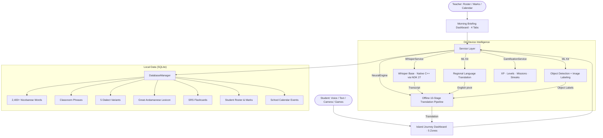

# SpeechMate — Architecture Deep Dive (Institutional Edition v1.5.0)

## System Overview



---

## Dashboard Layer

### Student Dashboard — Island Journey (v1.5.0)

5 independently scrollable zones built as a single `CustomScrollView` with `SliverList`:

| Zone | Widget | State Source |
| :--- | :--- | :--- |
| **Zone 1: Hero Header** | `IslandHeroHeader` | `ProgressService` (XP, streak, level) |
| **Zone 2: Island Map Grid** | `IslandMapGrid` | Static category config → `CategoryScreen` router |
| **Zone 3: Activity Strip** | `ActivityQuickLaunchStrip` | Hard-coded nav targets (games, voice, camera, quiz) |
| **Zone 4: Progress Cove** | `ProgressCoveWidget` | `ProgressService` (XP bar, stars, level name) |
| **Zone 5: Discovery Shelf** | `DiscoveryShelfScroll` | `DatabaseManager` (word of day), static phrase cards |

### Teacher Dashboard — Morning Briefing (v1.5.0)

4-tab `DefaultTabController` with tab-specific state isolation:

| Tab | Widget | Persistence |
| :--- | :--- | :--- |
| **Roster** | `RosterTab` | SQLite `students` table |
| **Marks** | `MarksTab` | SQLite `marks` table |
| **Analytics** | `AnalyticsTab` | Computed from `marks` table |
| **Calendar** | `CalendarTab` | SQLite `events` table |

---

## Service Layer

| Service | Responsibility |
| :--- | :--- |
| `WhisperService` | Native C++ Whisper Base inference via NDK 27. Handles audio chunking, VAD, and transcript output. |
| `NeuralEngine` / `TranslationService` | 10-stage offline translation pipeline (see below). |
| `DatabaseManager` | SQLite wrapper. Seeds all JSON lexicons on first launch. Manages roster, marks, and calendar. Indexed for O(1) dictionary lookup. |
| `ProgressService` | SharedPreferences-backed XP, streak, and level state. |
| `GamificationService` | Mission generation, XP award logic, level-up thresholds, confetti triggers. |
| `FeedbackService` | Stores user-submitted word corrections locally for teacher review. |

---

## Offline Translation Pipeline (10 Stages)

All translation is **deterministic** — no neural networks, no generative AI.

| Stage | Method | Purpose |
|:---|:---|:---|
| 1 | **Full Phrase Match** | Exact sentence lookup in phrase table |
| 2 | **Bigram Match** | 2-word compound lookup |
| 3 | **Trigram Match** | 3-word compound lookup |
| 4 | **Exact Dictionary Lookup** | O(1) indexed SQLite match |
| 5 | **Context Disambiguation** | Resolves polysemous words via surrounding tokens |
| 6 | **Stemming** | 15+ English suffix rules (e.g., -ing, -ed, -s) |
| 7 | **Synonym Expansion** | 200+ curated synonym mappings |
| 8 | **Soundex Phonetic Match** | Catches misspellings by phonetic similarity |
| 9 | **Compound Word Decomposition** | Splits compounds (e.g., "rainforest" → "rain" + "forest") |
| 10 | **Fuzzy Search** | Levenshtein edit-distance matching (max distance: 2) |

> **Note:** Stages 5–10 are implemented but have not been benchmarked for accuracy against a held-out test set. Accuracy metrics are a roadmap item.

---

## Regional Translation Flow

```
User input (Hindi / Tamil / Bengali / Telugu / Kannada)
    │
    ▼
Google ML Kit (offline model — downloaded on first use)
    │
    ▼ (English pivot text)
NeuralEngine (10-stage pipeline)
    │
    ▼
Nicobarese output
```

| Language | Engine | Connectivity |
| :--- | :--- | :--- |
| Hindi | Google ML Kit | ✅ Offline |
| Tamil | Google ML Kit | ✅ Offline |
| Bengali | Google ML Kit | ✅ Offline |
| Telugu | Google ML Kit | ✅ Offline |
| Kannada | Google ML Kit | ✅ Offline |

> ML Kit models must be downloaded on first use. After download, they operate fully offline.

---

## Data Layer

All linguistic data lives in `assets/data/` and is seeded to SQLite on first app launch.

| File | Category | Approx. Entries |
| :--- | :--- | :--- |
| `dictionary.json` | Core Nicobarese | 2,400+ |
| `dictionary_numbers.json` | Numbers | ~20 |
| `dictionary_nature.json` | Nature | ~30 |
| `dictionary_colors.json` | Colors | ~15 |
| `dictionary_feelings.json` | Emotions | ~20 |
| `dictionary_things.json` | Everyday objects | ~40 |
| `dictionary_body_parts.json` | Body parts | ~30 |
| `dictionary_animals.json` | Animals | ~20 |
| `dictionary_magic.json` | Greetings / Magic words | ~25 |
| `dictionary_family.json` | Family | ~20 |
| `dictionary_phrases.json` | Classroom phrases | ~30 |
| `dictionary_dialects.json` | 5-dialect comparison | large |
| `dictionary_great_andamanese.json` | Great Andamanese | 1,000+ |

### Entry Format

```json
{
  "english": "Water",
  "nicobarese": "Mak",
  "emoji": "💧",
  "audio": "water.mp3"
}
```

---

## Why Offline-First?

- **Accessibility** — Andaman & Nicobar island schools have frequent signal dead zones.
- **Privacy** — Voice recordings never leave the device.
- **Data sovereignty** — Indigenous linguistic data is stored locally, not by a cloud provider.
- **Speed** — No server round-trips; dictionary responses are <100ms.

---

## Adding a New Language

SpeechMate is language-agnostic by design:

1. Create `assets/data/dictionary_<lang>.json`
2. Add audio to `assets/audio/<lang>/`
3. Register in `main.dart` → `seedCategoryFromJson()`
4. Add a language tile in `app_language_select.dart`
