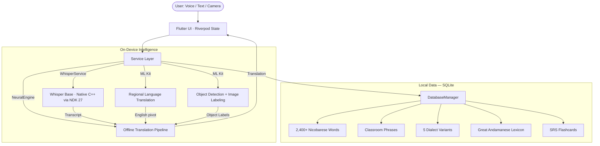

# SpeechMate — Architecture

## System Overview



---

## Service Layer

| Service | Responsibility |
| :--- | :--- |
| `WhisperService` | Native C++ Whisper Base inference via NDK 27. Audio chunking, VAD, and transcript output. |
| `NeuralEngine` | 10-stage offline translation pipeline — deterministic, no generative AI. |
| `DatabaseManager` | SQLite wrapper. Seeds all JSON lexicons on first launch. Indexed for O(1) lookup. |
| `ProgressService` | SharedPreferences-backed XP, streak, and level state. |
| `GamificationService` | Mission generation, XP award logic, level-up thresholds. |
| `FeedbackService` | Stores user-submitted word corrections locally for elder/teacher review. |

---

## Offline Translation Pipeline

All translation is **deterministic** — no neural networks, no generative AI, no cloud dependency.

| Stage | Method | Purpose |
|:---|:---|:---|
| 1 | **Full Phrase Match** | Exact sentence lookup in phrase table |
| 2 | **Bigram Match** | 2-word compound lookup |
| 3 | **Trigram Match** | 3-word compound lookup |
| 4 | **Exact Dictionary Lookup** | O(1) indexed SQLite match |
| 5 | **Context Disambiguation** | Resolves polysemous words via surrounding tokens |
| 6 | **Stemming** | 15+ English suffix rules (e.g., -ing, -ed, -s) |
| 7 | **Synonym Expansion** | 200+ curated synonym mappings |
| 8 | **Soundex Phonetic Match** | Catches misspellings by phonetic similarity |
| 9 | **Compound Word Decomposition** | Splits compounds (e.g., "rainforest" → "rain" + "forest") |
| 10 | **Fuzzy Search** | Levenshtein edit-distance matching (max distance: 2) |

---

## Regional Translation Flow

```
User input (Hindi / Tamil / Bengali / Telugu / Malayalam)
    │
    ▼
Google ML Kit (offline) / Cloud translator (Malayalam only)
    │
    ▼ (English pivot text)
NeuralEngine (10-stage pipeline)
    │
    ▼
Nicobarese output
```

| Language | Engine | Connectivity |
| :--- | :--- | :--- |
| Hindi | Google ML Kit | ✅ Offline |
| Tamil | Google ML Kit | ✅ Offline |
| Bengali | Google ML Kit | ✅ Offline |
| Telugu | Google ML Kit | ✅ Offline |
| Malayalam | `translator` package | 🌐 Online required |

> ML Kit models download on first use, then operate fully offline.

---

## Data Layer

All linguistic data lives in `assets/data/` and is seeded to SQLite on first app launch. See [`LINGUISTIC_SOURCES.md`](LINGUISTIC_SOURCES.md) for academic references and validation methodology.

| File | Category | Entries |
| :--- | :--- | :--- |
| `dictionary.json` | Core Nicobarese | 2,400+ |
| `dictionary_great_andamanese.json` | Great Andamanese | 1,000+ |
| `dictionary_dialects.json` | 5-dialect comparison | Large |
| `dictionary_phrases.json` | Classroom phrases | ~30 |
| + 9 category-specific lexicons | Numbers, Nature, Colors, Feelings, Things, Body Parts, Animals, Greetings, Family | ~220 |

---

## Why Offline-First?

- **Accessibility** — A&N islands have frequent signal dead zones
- **Privacy** — Voice recordings never leave the device
- **Data sovereignty** — Indigenous linguistic data is stored locally, not by a cloud provider
- **Speed** — No server round-trips; dictionary responses are <100ms

---

## Language-Agnostic Design

SpeechMate can support any new language with 4 steps:

1. Create `assets/data/dictionary_<lang>.json`
2. Add audio to `assets/audio/<lang>/`
3. Register in `main.dart` → `seedCategoryFromJson()`
4. Add a language tile in `app_language_select.dart`
